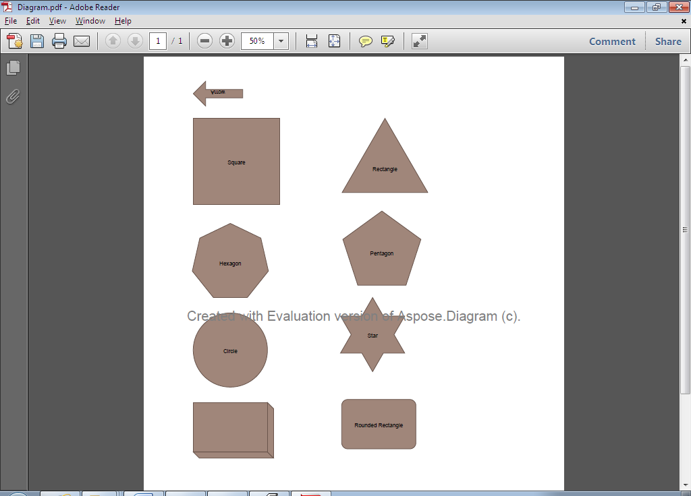

## **Exporting to PDF**
{}

Aspose.Diagram for Java directly writes the information about the API and Version Number in output documents. For example, upon rendering a Drawing to PDF, Aspose.Diagram for Java populates **Application** field with value 'Aspose.Diagram' and **PDF Producer** field with a value, e.g 'Aspose.Diagram 17.9'.

Please note that you cannot instruct Aspose.Diagram for Java API to change or remove this information from output Documents.

{}

This article explains how to export a Microsoft Visio diagram to PDF using [Aspose.Diagram for Java](https://products.aspose.com/diagram/java/) API.

Use the [Diagram](https://reference.aspose.com/diagram/java/com.aspose.diagram/Diagram) class' constructor to read the diagram files and the Save method to export the diagram to any supported image format.

The image below shows the VSD diagram that the code snippets below export PDF. You can use other diagram formats (VSS, VSSX, VSSM, VDX, VST, VSTX, VSTM, VDX, VTX or VSX) as well.

**The source file.**


To export VSD diagram to PDF:

1. Create an instance of the Diagram class.
1. Call the Diagram classs Save method and set the output format to PDF.

Below is an image of the output PDF file.

**The output PDF file.**


### **Exporting to PDF Programming Sample**
```

// For complete examples and data files, please go to https://github.com/aspose-diagram/Aspose.Diagram-for-Java
// The path to the documents directory.
String dataDir = Utils.getDataDir(ExportToPDF.class);

// Call the diagram constructor to load diagram from a VSD file
Diagram diagram = new Diagram(dataDir + "ExportToPDF.vsd");

// Save as PDF file format
diagram.save(dataDir + "ExportToPDF_Out.pdf", SaveFileFormat.PDF);


```
### **Split Multiple Pages**
Aspose.Diagram for Java allows splitting multiple pages while converting the Microsoft Visio Diagram to PDF. The following code snippet shows the functionality.  

```

// For complete examples and data files, please go to https://github.com/aspose-diagram/Aspose.Diagram-for-Java
// The path to the documents directory.
String dataDir = Utils.getDataDir(UsePDFSaveOptions.class);      
// Call the diagram constructor to load diagram from a VSDX file
Diagram diagram = new Diagram(dataDir + "Network Diagram_start.vsdx");
// Options when saving a diagram into the PDF format
PdfSaveOptions options = new PdfSaveOptions();
// set SplitMultiPages option
options.setSplitMultiPages(true);
// save in PDF format
diagram.save(dataDir + "SplitMultiPages.pdf", options);


```
### **Use Page Save Callback**
In case you have multiple pages, Aspose.Diagram for Java allows using page saving callback while converting the Microsoft Visio Diagram to PDF. The following code snippet shows the functionality.  

```

// For complete examples and data files, please go to https://github.com/aspose-diagram/Aspose.Diagram-for-Java
// The path to the documents directory.
String dataDir = Utils.getDataDir(DocumentConversionProgress.class);
// load a Visio diagram
Diagram diagram = new Diagram(dataDir + "Drawing1.vsdx");

// create an instance PDF save options class
PdfSaveOptions options = new PdfSaveOptions();
          
//set page saving call back
options.setPageSavingCallback( new TestDiagramPageSavingCallback());

// save Visio drawing
diagram.save(dataDir + "Callback_out.pdf", options);


```

#### **TestDiagramPageSavingCallback Class**
```

// For complete examples and data files, please go to https://github.com/aspose-diagram/Aspose.Diagram-for-Java
import com.aspose.diagram.IPageSavingCallback;
import com.aspose.diagram.PageEndSavingArgs;
import com.aspose.diagram.PageStartSavingArgs;

public class TestDiagramPageSavingCallback implements IPageSavingCallback
{
    public void pageStartSaving(PageStartSavingArgs args)
    {
    	System.out.println("Start saving page index " + args.getPageIndex() + " of pages " + args.getPageCount());
    }

    public void pageEndSaving(PageEndSavingArgs args)
    {
    	System.out.println("End saving page index " + args.getPageIndex() + " of pages " + args.getPageCount());

        //don't output pages after page index 8.
        if (args.getPageIndex() >= 8)
        {
            args.setHasMorePages(false);
        }
    }
}



```
