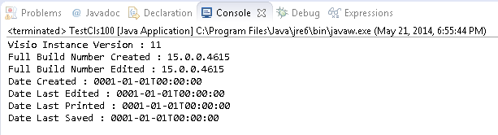
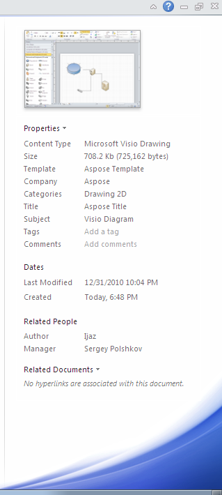

{} 

Microsoft Visio saves information about actions taken on a diagram within the file. For example, the time and date that the document was created, the last time it was edited, printed or saved, is saved with the file. Information about which version of Microsoft Visio created and last edited the file is also saved.

This article explains how to retrieve that information.

{} 
## **Get the Version of the Aspose.Diagram for Java Library**
The getVersion() memthod exposed by the [Diagram](https://reference.aspose.com/diagram/java/com.aspose.diagram/Diagram) class and the getBuildNumberCreated() method exposed by the [DocumentProperties](https://reference.aspose.com/diagram/java/com.aspose.diagram/DocumentProperties) class are used to determine the version and full build number of the Microsoft Visio instance used to create the document.
### **Determining the Version of Microsoft Visio that's Created, Edited and Saved a Document**
The getBuildNumberEdited() method exposed by the [DocumentProperties](https://reference.aspose.com/diagram/java/com.aspose.diagram/DocumentProperties) class is used to determine the full build number of the Microsoft Visio instance used to edit the document.

The getTimeCreated(), getTimeEdited(), getTimePrinted() and getTimeSaved() methods exposed by the [DocumentProperties](https://reference.aspose.com/diagram/java/com.aspose.diagram/DocumentProperties) class are used to determine the time that the Microsoft Visio document was created, last edited, last printed and last saved.

You can also set these properties to change the information in the file.

The code samples below show how to retrieve information about what created the file as well as when it was created, edited, printed and saved.

**The code output in a console window** 


#### **Programming Sample**
```

// For complete examples and data files, please go to https://github.com/aspose-diagram/Aspose.Diagram-for-Java
// The path to the documents directory.
String dataDir = Utils.getDataDir(GetLibraryVersion.class);
// build path of an existing diagram
String path = dataDir + "Drawing1.vsdx";

//Call the diagram constructor to load diagram from a VDX file
Diagram diagram = new Diagram(path);

//Display Visio version and document modification time at different stages
System.out.println("Visio Instance Version : " + diagram.getVersion());
System.out.println("Full Build Number Created : " + diagram.getDocumentProps().getBuildNumberCreated());
System.out.println("Full Build Number Edited : " + diagram.getDocumentProps().getBuildNumberEdited());
System.out.println("Date Created : " + diagram.getDocumentProps().getTimeCreated());
System.out.println("Date Last Edited : " + diagram.getDocumentProps().getTimeEdited());
System.out.println("Date Last Printed : " + diagram.getDocumentProps().getTimePrinted());
System.out.println("Date Last Saved : " + diagram.getDocumentProps().getTimeSaved());


```
## **Writing Microsoft Visio Document Summary Info**
Microsoft Visio lets you define a number of document summary information properties to help you and your colleagues identify a diagram. Summary properties, for example title, subject, author and description, makes the file easier to find when searching, and easier to recognize when browsing files.

The [DocumentProperties](https://reference.aspose.com/diagram/java/com.aspose.diagram/DocumentProperties) class exposes a number of properties to set or get a Microsoft Visio diagram's summary information. Aspose.Diagram for Java can update the drawing summary information and then write the drawing file back to VDX.

{} 

Please note that you cannot set values against the **Application** and **Producer** fields, because Aspose Ltd. and Aspose.Diagram for Java x.x.x will be displayed against these fields.

{} 
### **Writing Microsoft Visio Document Summary Info**
To update the drawing summary information of an existing VDX or VSD file:

1. Create an instance of the [Diagram](https://reference.aspose.com/diagram/java/com.aspose.diagram/Diagram) class.
1. Set properties exposed by Diagram.getDocumentProps() method to define the summary information for the Visio drawing file.
1. Call the Diagram class' save() method to write the Visio drawing file to VDX.

Check the summary information:

1. Open the output VDX file in Microsoft Visio.
1. Selecting **Info** from the **File** menu.

**The Info dialog showing the updated summary information** 


#### **Programming Sample**
```

// For complete examples and data files, please go to https://github.com/aspose-diagram/Aspose.Diagram-for-Java
// The path to the documents directory.
String dataDir = Utils.getDataDir(SetVisioProperties.class);
// build path of an existing diagram
String path = dataDir + "Drawing1.vsdx";

//Call the diagram constructor to load diagram from a VSDX file
Diagram diagram = new Diagram(path);

//Set some summary information about the diagram
diagram.getDocumentProps().setCreator("Ijaz");
diagram.getDocumentProps().setCompany("Aspose");
diagram.getDocumentProps().setCategory("Drawing 2D");
diagram.getDocumentProps().setManager("Sergey Polshkov");
diagram.getDocumentProps().setTitle("Aspose Title");
diagram.getDocumentProps().setTimeCreated(DateTime.getNow());
diagram.getDocumentProps().setSubject("Visio Diagram");
diagram.getDocumentProps().setTemplate("Aspose Template");

//Write the updated file to the disk in VSDX file format
diagram.save(dataDir + "SetVisioProperties_Out.vsdx", SaveFileFormat.VSDX);


```
## **Detect the Format of a Visio File**
Using [Aspose.Diagram for Java](https://products.aspose.com/diagram/java/) API, developers can detect the format of Visio file before opening it because the file extension does not guarantee that the file content is appropriate.
### **Detect Format Programming Sample**
The following sample code illustrates how to detect a file format (using the file path or stream) and check its extension.

```

// For complete examples and data files, please go to https://github.com/aspose-diagram/Aspose.Diagram-for-Java
// The path to the documents directory.
String dataDir = Utils.getDataDir(DetectVisioFileFormat.class);

		// detect file format using the direct file path
		FileFormatInfo info = FileFormatUtil.detectFileFormat(dataDir + "Drawing1.vsdx");

		// get the detected file format
		System.out.println("The spreadsheet format is: " + info.getFileFormatType());


```
## **Detect the Format of a Visio File from an InputStream**
Using Aspose.Diagram for Java API, developers can detect the format of a Visio file by passing an input stream. The detectFileFormat method of FileFormatUtil class can be used to achieve this.
### **Detect Format from an InputStream Programming Sample**
The following sample code illustrates how to detect a file format using an input stream.

```

// For complete examples and data files, please go to https://github.com/aspose-diagram/Aspose.Diagram-for-Java
// The path to the documents directory.
String dataDir = Utils.getDataDir(DetectFormatfromInputStream.class);

// Open the stream. Read only access to load a Visio diagram.
String stream = new String(dataDir + "Drawing1.vsdx");
// detect file format using an input stream
FileFormatInfo info = FileFormatUtil.detectFileFormat(stream);

// get the detected file format
System.out.println("The spreadsheet format is: " + info.getFileFormatType());


```
