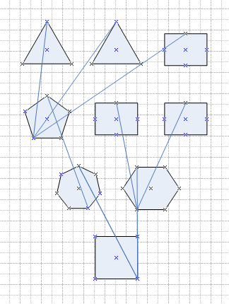

## **Creating a Diagram**
Aspose.Diagram for Java lets you read and create Microsoft Visio diagrams from within your own applications, without Microsoft Office Automation. The first step when creating new documents, is to create a diagram. Then [add shapes and connectors](/diagram/java/add-and-connect-visio-shapes/) to build up the diagram. Use the default constructor of [Diagram](https://reference.aspose.com/diagram/java/com.aspose.diagram/diagram) class to create a new diagram.
### **Programming Sample**


// For complete examples and data files, please go to https://github.com/aspose-diagram/Aspose.Diagram-for-Java
// The path to the documents directory.
String dataDir = Utils.getDataDir(CreateDiagram.class);
// Create directory if it is not already present.
File file = new File(dataDir);
if (!file.exists())
	file.mkdir();
// initialize a new Diagram
Diagram diagram = new Diagram();
// save in the VSDX format
diagram.save(dataDir + "CreateDiagram_Out.vsdx", SaveFileFormat.VSDX);



## **Layout Shapes in Flowchart Style**
With certain types of connected drawings, such as flowcharts and network diagrams, you can use the **Layout Shapes** feature to automatically position shapes. Automatically positioning is faster than manually dragging each shape to a new location.

For example, if you're updating a large flowchart to include a new process, you can add and connect the shapes that make up the process, and then use the layout feature to automatically layout the updated drawing.

The Layout method, exposed by the [Diagram](https://reference.aspose.com/diagram/java/com.aspose.diagram/diagram) class layouts the shapes and/or reroutes the connectors on all the diagram's pages. This method accepts an LayoutOptions object as an argument. Use the different properties exposed by the LayoutOptions class to automatically layout shapes.

The image below shows the diagram loaded by the code snippets in this article, before auto layout is applied. The code snippets show how to apply [flowchart layouts](/diagram/java/create-2c-layout-and-auto-fit-shapes/) and [compact tree layouts](/diagram/java/create-2c-layout-and-auto-fit-shapes/).

**The source diagram.** 

The code snippets in this article takes the source diagram and applies several types of auto layout to it, saving each in a separate file.

|
**Layout shapes bottom to top** 

|
**Layout shapes top to bottom** 

|
| :- | :- |
|
**Layout shapes left to right** 

|
**Layout shapes right to left** 

|
To layout shapes in flowchart style:

1. Create an instance of the Diagram class.
1. Create an instance of LayoutOptions class and set Flowchart style related properties.
1. Call the Diagram class' Layout method by passing LayoutOptions.
1. Call the Diagram class' Save method to write the Visio drawing.
### **Flowchart Style Programming Sample**


// For complete examples and data files, please go to https://github.com/aspose-diagram/Aspose.Diagram-for-Java
// The path to the documents directory.
String dataDir = Utils.getDataDir(LayOutShapesInFlowchartStyle.class);     

// load an existing Visio diagram
String fileName = "LayOutShapesInFlowchartStyle.vdx";
Diagram diagram = new Diagram(dataDir + fileName);

// set layout options 
LayoutOptions flowChartOptions = new LayoutOptions();
flowChartOptions.setLayoutStyle(LayoutStyle.FLOW_CHART);
flowChartOptions.setSpaceShapes(1f);
flowChartOptions.setEnlargePage(true);

// set layout direction as BottomToTop and then save
flowChartOptions.setDirection(LayoutDirection.BOTTOM_TO_TOP);
diagram.layout(flowChartOptions);
diagram.save(dataDir + "sample_btm_top.vdx", SaveFileFormat.VDX);

// set layout direction as TopToBottom and then save
diagram = new Diagram(dataDir + fileName);
flowChartOptions.setDirection(LayoutDirection.TOP_TO_BOTTOM);
diagram.layout(flowChartOptions);
diagram.save(dataDir + "sample_top_btm.vdx", SaveFileFormat.VDX);

// set layout direction as LeftToRight and then save
diagram = new Diagram(dataDir + fileName);
flowChartOptions.setDirection(LayoutDirection.LEFT_TO_RIGHT);
diagram.layout(flowChartOptions);
diagram.save(dataDir + "sample_left_right.vdx", SaveFileFormat.VDX);

// set layout direction as RightToLeft and then save
diagram = new Diagram(dataDir + fileName);
flowChartOptions.setDirection(LayoutDirection.RIGHT_TO_LEFT);
diagram.layout(flowChartOptions);
diagram.save(dataDir + "sample_right_left.vdx", SaveFileFormat.VDX);



### **Laying Out Shapes in the Compact Tree Style**
The compact tree layout style tries to built a tree structure. It uses the same input file as the [example above](/diagram/java/create-2c-layout-and-auto-fit-shapes/) and saves out to several different compact tree styles.

|
**Compact tree layout - down and right** 

|
| :- |
|
**Compact tree layout - down and left** 

|

|
**Compact tree layout - right and down** 

|
**Compact tree layout - left and down** 

|
| :- | :- |
To layout shapes in the compact tree style:

1. Create an instance of the [Diagram](https://reference.aspose.com/diagram/java/com.aspose.diagram/diagram) class.
1. Create an instance of the LayoutOptions class and set compact tree style properties.
1. Call the Diagram class' Layout method by passing LayoutOptions.
1. Call the the Diagram class' Save method to write the Visio file.
#### **Compact Tree Style Programming Sample**


// For complete examples and data files, please go to https://github.com/aspose-diagram/Aspose.Diagram-for-Java
// The path to the documents directory.
String dataDir = Utils.getDataDir(LayOutShapesInCompactTreeStyle.class);
        
String fileName = "LayOutShapesInCompactTreeStyle.vdx";
// load an existing Visio diagram
Diagram diagram = new Diagram(dataDir + fileName);

// set layout options 
LayoutOptions compactTreeOptions = new LayoutOptions();
compactTreeOptions.setLayoutStyle(LayoutStyle.COMPACT_TREE);
compactTreeOptions.setEnlargePage(true);

// set layout direction as DownThenRight and then save
compactTreeOptions.setDirection(LayoutDirection.DOWN_THEN_RIGHT);
diagram.layout(compactTreeOptions);
diagram.save(dataDir + "sample_down_right.vdx", SaveFileFormat.VDX);

// set layout direction as DownThenLeft and then save
diagram = new Diagram(dataDir + fileName);
compactTreeOptions.setDirection(LayoutDirection.DOWN_THEN_LEFT);
diagram.layout(compactTreeOptions);
diagram.save(dataDir + "sample_down_left.vdx", SaveFileFormat.VDX);

// set layout direction as RightThenDown and then save
diagram = new Diagram(dataDir + fileName);
compactTreeOptions.setDirection(LayoutDirection.RIGHT_THEN_DOWN);
diagram.layout(compactTreeOptions);
diagram.save(dataDir + "sample_right_down.vdx", SaveFileFormat.VDX);

// set layout direction as LeftThenDown and then save
diagram = new Diagram(dataDir + fileName);
compactTreeOptions.setDirection(LayoutDirection.LEFT_THEN_DOWN);
diagram.layout(compactTreeOptions);
diagram.save(dataDir + "sample_left_down.vdx", SaveFileFormat.VDX);



## **Auto-fit the Visio Diagram**
Aspose.Diagram API supports auto-fitting of the Visio drawing. This feature operation helps to bring outside shapes inside the Visio page boundary.

Aspose.Diagram for Java API has the Diagram class that represents a Visio drawing. The DiagramSaveOptions class exposes AutoFitPageToDrawingContent property to auto fit the Visio drawing.

This example work as follows:

1. Create an object of the Diagram class.
1. Create an object of the DiagramSaveOptions class and pass the resultant file format.
1. Set AutoFitPageToDrawingContent property of the DiagramSaveOptions object.
1. Call Save method of the Diagram class object and also pass complete file path and the DiagramSaveOptions object.
### **Auto-fit Programming Sample**
The following example code shows how to auto-fit shapes in the Visio diagram.


// For complete examples and data files, please go to https://github.com/aspose-diagram/Aspose.Diagram-for-Java
// The path to the documents directory.
String dataDir = Utils.getDataDir(AutoFitShapesInVisio.class);
// load a Visio diagram
Diagram diagram = new Diagram(dataDir + "BFlowcht.vsdx");

// use saving options
DiagramSaveOptions options = new DiagramSaveOptions(SaveFileFormat.VSDX);
// set Auto fit page property
options.setAutoFitPageToDrawingContent(true);

// save Visio diagram
diagram.save(dataDir + "AutoFitShapesInVisio_Out.vsdx", options);



## **Working with VBA Project**
### **Modify VBA Module Code in Visio Diagram**
This article demonstrates how to modify a VBA module code automatically using Aspose.Diagram for Java.

We have added VbaModule, VbaModuleCollection, VbaProject, VbaProjectReference and VbaProjectReferenceCollection classes. These classes help to get control over VBA project. Developers can extract and modify VBA module code.
### **Modify VBA Module Code Programming Sample**
Please check this code example:


// For complete examples and data files, please go to https://github.com/aspose-diagram/Aspose.Diagram-for-Java
// load an existing Visio diagram
String dataDir = Utils.getDataDir(ModifyVBAModuleCode.class);
InputStream input = new FileInputStream(dataDir + "macro.vsdm");
Diagram diagram = new Diagram(input);
// extract VBA project
VbaProject v = diagram.getVbaProject();
// Iterate through the modules and modify VBA macro code
for (int i = 0; i < diagram.getVbaProject().getModules().getCount(); i++) {
	VbaModule module = diagram.getVbaProject().getModules().get(i);
	String code = module.getCodes();
	if (code.contains("This is test message."))
		code = code.replace("This is test message.", "This is Aspose.Diagram message.");
	module.setCodes(code);
}
// save the Visio diagram
diagram.save(dataDir + "out.vssm", SaveFileFormat.VSSM);



### **Remove All Macros from the Visio Diagram**
Aspose.Diagram for Java allows developers to remove all macros from the Visio diagram.

The JavaProjectData property, exposed by the [Diagram](https://reference.aspose.com/diagram/java/com.aspose.diagram/diagram) class, allows you to remove all macros from the Visio drawing.
### **Remove All Macros Programming Sample**


// For complete examples and data files, please go to https://github.com/aspose-diagram/Aspose.Diagram-for-Java
// The path to the documents directory.
String dataDir = Utils.getDataDir(RemoveMacrosFromVisio.class);  
// load a Visio diagram
Diagram diagram = new Diagram(dataDir + "Drawing1.vsdx");

// remove all macros
diagram.setVbProjectData(null);

// Save diagram
diagram.save(dataDir + "RemoveMacrosFromVisio_Out.vsdx", SaveFileFormat.VSDX);



