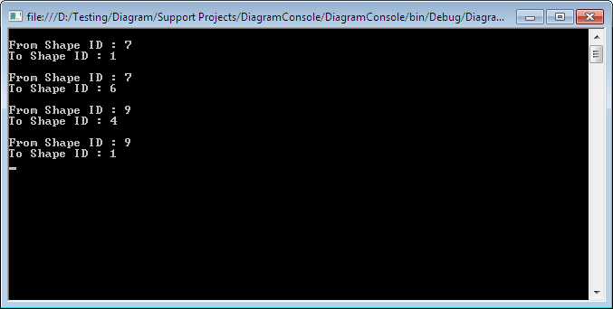
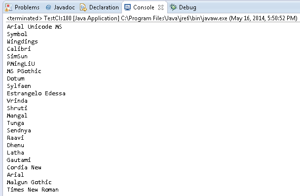

## **Retrieving Connector Information**
Aspose.Diagram for Java provides mechanisms for retrieving information - ID and name - about [pages](/diagram/java/retrieve-get-copy-and-insert-a-page/) and [master](). It also lets you get information about connectors, the elements that link shapes.

The [Connect](https://reference.aspose.com/diagram/java/com.aspose.diagram/connect) object represents a connector that joins two shapes on a Visio drawing page. The Connects property, exposed by the [Page](https://reference.aspose.com/diagram/java/com.aspose.diagram/page) class supports a collection of Aspose.Diagram.Connect objects. This property can be used to retrieve ID and name information about a connector.

**A console window showing the output from the code below.** 

### **Programming Sample**
The following piece of code retrieves the information for the connectors in a diagram.


// For complete examples and data files, please go to https://github.com/aspose-diagram/Aspose.Diagram-for-Java
// The path to the documents directory.
String dataDir = Utils.getDataDir(RetrieveConnectorInfo.class);
        
//Call the diagram constructor to load diagram from a VSD file
Diagram diagram = new Diagram(dataDir + "RetrieveConnectorInfo.vsd");        
for(Connect connector : (Iterable<Connect>) diagram.getPages().getPage(0).getConnects())
{
    // Display information about the Connectors
    System.out.println("\nFrom Shape ID : " + connector.getFromSheet());
    System.out.println("To Shape ID : " + connector.getToSheet());
 }

System.out.println("Process Completed Successfully");



## **Retrieving Font Information**
Aspose.Diagram has mechanisms for retrieving information about the elements that make up a diagram, from [pages](/diagram/java/retrieve-get-copy-and-insert-a-page/), [stencils](), [connectors](https://reference.aspose.com/diagram/java/com.aspose.diagram/ConnectCollection) and also fonts. This article shows how to find out which fonts are used in a diagram.

The [Font](https://reference.aspose.com/diagram/java/com.aspose.diagram/font) object represents a typeface that is either applied to text in a document or available for use on the system.

A Font object maps a name (for example, "Arial") to the font ID (for example, 3) that Microsoft Visio stores in a Font cell in a Character section of a shape that contains text formatted with that font. Font IDs can change when a document is opened on different systems or when fonts are installed or removed.
### **Retrieving Font Programming Sample**
The following piece of code retrieves font information from the Visio diagram.


// For complete examples and data files, please go to https://github.com/aspose-diagram/Aspose.Diagram-for-Java
// The path to the documents directory.
String dataDir = Utils.getDataDir(RetrieveFontInfo.class);

// call the diagram constructor to load diagram
Diagram diagram = new Diagram(dataDir+ "RetrieveFontInfo.vsd");

for(Font font : (Iterable) diagram.getFonts())
{
    // Display information about the fonts
    System.out.println(font.getName());
}

System.out.println("Process Completed Successfully");



### **Getting Default Font Directory**
Aspose.Diagram for Java API also allows getting default font directory path using getDefaultFontDir() method of Diagram Class. The following piece of code retrieves default font directory from the Visio diagram.


// For complete examples and data files, please go to https://github.com/aspose-diagram/Aspose.Diagram-for-Java
// The path to the documents directory.
String dataDir = Utils.getSharedDataDir(RetrieveFontInfo.class) + "Diagrams/";

// Call the diagram constructor to load diagram
Diagram diagram = new Diagram(dataDir + "RetrieveFontInfo.vsd");

// Display font default directory
System.out.println(diagram.getDefaultFontDir());



