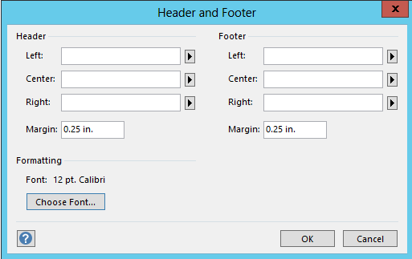

{} 

Aspose.Diagram for Java provides a mechanism for setting headers and footers of the Microsoft Office Visio diagrams. Developers can get or set the text string that appears on the left, center and right side of a document header/footer. They can also set header and footer margin along with the font properties of the text.

{} 
### **Setting Headers and Footers Properties**
The [Diagram](https://reference.aspose.com/diagram/java/com.aspose.diagram/diagram) class object offers HeaderFooter property which allows to get and set header and footer text, font and margin values. During the print preview of Visio drawing, users can click on "Edit Header & Footer" link button in Microsoft Visio 2013 (in Microsoft Visio 2010 >> "Header & Footer" button). There are a few options to add text as shown in the screenshot below. Users can manage these properties programmatically using Aspose.Diagram API as follows:

**Manage Headers and Footers text, margins and font properties.** 



The following piece of code helps to manage Headers and Footers Properties.
#### **Programming Samples**
```

// For complete examples and data files, please go to https://github.com/aspose-diagram/Aspose.Diagram-for-Java
// The path to the documents directory.
String dataDir = Utils.getDataDir(ManageHeadersandFooters.class);
// call the diagram constructor to a load Visio diagram
Diagram diagram = new Diagram(dataDir + "Drawing1.vsdx");

// add page number at the right corner of header
diagram.getHeaderFooter().setHeaderRight("&p");

// set text at the center
diagram.getHeaderFooter().setHeaderCenter("Center of the header");

// set text at the left side
diagram.getHeaderFooter().setHeaderLeft("Left of the header");

// add text at the right corner of footer
diagram.getHeaderFooter().setFooterRight("Right of the footer");

// set text at the center
diagram.getHeaderFooter().setFooterCenter("Center of the footer");

// set text at the left side
diagram.getHeaderFooter().setFooterLeft("Left of the footer");

// set header & footer color
diagram.getHeaderFooter().setHeaderFooterColor(Color.getRed());

// set text font properties
diagram.getHeaderFooter().getHeaderFooterFont().setItalic(BOOL.TRUE);
diagram.getHeaderFooter().getHeaderFooterFont().setUnderline(BOOL.FALSE);

// save Visio diagram
diagram.save(dataDir + "EditConnectorGeometry_Out.vsdx", SaveFileFormat.VSDX);


```
