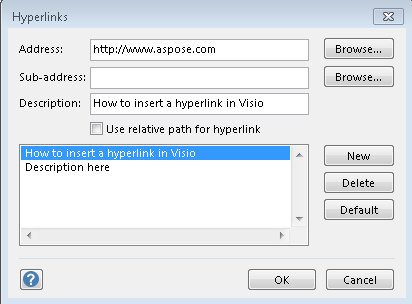
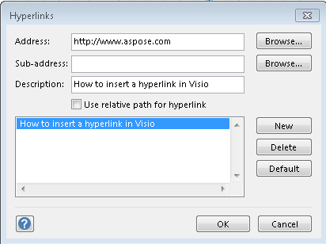
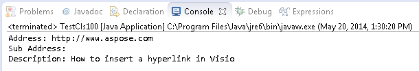

## **Add Hyperlink to a Visio Shape**
It is an easy approach to add hyperlink to Microsoft Visio shape dynamically.

On multi page Visio drawings, hyperlinks can move you from one page to another. You also can link your drawing to a web page or a file on your system.

These properties are exposed by the [Shape](https://reference.aspose.com/diagram/java/com.aspose.diagram/Shape) class supports the [com.aspose.diagram.Hyperlink](https://reference.aspose.com/diagram/java/com.aspose.diagram/hyperlink) object. The add method can be used to add a shape's hyperlink data.

To identify properties in Microsoft Visio:

1. In a diagram, right-click a shape.
1. Select **Hyperlink**.
1. Set existing properties
1. Press **OK** button

**A shape's hyperlink data, as seen in Microsoft Visio**

The code snippets below adds shape's hyperlink data.
### **Add Hyperlink Programming Sample**


// For complete examples and data files, please go to https://github.com/aspose-diagram/Aspose.Diagram-for-Java
// The path to the documents directory.
String dataDir = Utils.getDataDir(AddHyperlinkToShape.class);   
// load source Visio diagram
Diagram diagram = new Diagram(dataDir + "Drawing1.vsdx");
// get page by name
Page page = diagram.getPages().getPage("Page-1");
// get shape by ID
Shape shape = page.getShapes().getShape(2);

//initialize Hyperlink object
Hyperlink hyperlink = new Hyperlink();
//set address value
hyperlink.getAddress().setValue("http://www.google.com/");
//set sub address value
hyperlink.getSubAddress().setValue("Sub address here");
//set description value
hyperlink.getDescription().setValue("Description here");
//set name
hyperlink.setName("MyHyperLink");

//add hyperlink to the shape
shape.getHyperlinks().add(hyperlink);            
//save diagram to local space
diagram.save(dataDir + "AddHyperlinkToShape_Out.vsdx", SaveFileFormat.VSDX);



## **Get Hyperlinks Data of the Visio Shapes**
It is possible to get a shape's hyperlink data in a similar way that you [reading Visio shape data]().

Developers can retrieve all hyperlinks from a Visio shape in the same way as they [read Visio shape data]() using [Aspose.Diagram for Java API](https://products.aspose.com/diagram/java/)

In multipage Visio drawings, hyperlinks can move you from one page to another. You also can link your drawing to a web page or a file on your system.

These properties are exposed by the [Shape](https://reference.aspose.com/diagram/java/com.aspose.diagram/Shape) class supports the [com.aspose.diagram.Hyperlink](https://reference.aspose.com/diagram/java/com.aspose.diagram/hyperlink) object. The property can be used to read a shape's hyperlink data.

To identify properties in Microsoft Visio:

1. In a diagram, right-click a shape.
1. Select **Hyperlink.**
   Any existing properties are listed in the dialog.

**A shape's hyperlink data, as seen in Microsoft Visio**

**A console window showing the shape data output**

The code snippets below reads shape's hyperlink data.
### **Get Hyperlinks Programming Sample**


// For complete examples and data files, please go to https://github.com/aspose-diagram/Aspose.Diagram-for-Java
// The path to the documents directory.
String dataDir = Utils.getDataDir(GetHyperlinks.class);  
// load source Visio diagram
Diagram diagram = new Diagram(dataDir + "Drawing1.vsdx");
// get page by name
Page page = diagram.getPages().getPage("Page-1");
// get shape by ID
Shape shape = page.getShapes().getShape(1);
// iterate through the hyperlinks
for (Hyperlink hyperlink :(Iterable<Hyperlink>) shape.getHyperlinks())
{
    System.out.println("Address: " + hyperlink.getAddress().getValue());
    System.out.println("Sub Address: " + hyperlink.getSubAddress().getValue());
    System.out.println("Description: " + hyperlink.getDescription().getValue());
}



