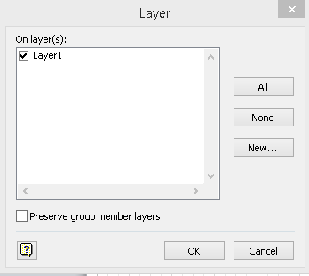

### **Configuring Shape Objects with Layers**
Aspose.Diagram for Java allows to configure shape objects with layers in Microsoft Office Visio diagram. Each shape can belong to multiple layers so developers can manage shapes to suit end user needs.

The [Shape](https://reference.aspose.com/diagram/java/com.aspose.diagram/Shape) class object offers LayerMember property which allows to add / remove shape objects to / from the layers in Visio drawing. Users can manage these properties programmatically using Aspose.Diagram API as follows:

**Add, remove and move shape objects to / from layers of the diagram.** 



The following piece of code helps to add, remove and move shape objects properties.
#### **Programming Samples**
```

// For complete examples and data files, please go to https://github.com/aspose-diagram/Aspose.Diagram-for-Java
// The path to the documents directory.
String dataDir = Utils.getDataDir(ConfigureShapeLayers.class);
        
//call the diagram constructor to load visio diagram
Diagram diagram = new Diagram(dataDir + "Drawing1.vsdx");
        
// iterate through the shapes
for (Shape shape : (Iterable<Shape>) diagram.getPages().getPage("Page-1").getShapes())
{
    if (shape.getName().toLowerCase() == "shape1")
    {
        //Add shape1 in first two layers. Here "0;1" are indexes of the layers
        LayerMem layer = shape.getLayerMem();
        layer.getLayerMember().setValue("0;1");
    }
    else if (shape.getName().toLowerCase() == "shape2")
    {
        //Remove shape2 from all the layers
        LayerMem layer = shape.getLayerMem();
        layer.getLayerMember().setValue("");
    }
    else if (shape.getName().toLowerCase() == "shape3")
    {
        //Add shape3 in first layer. Here "0" is index of the first layer
        LayerMem layer = shape.getLayerMem();
        layer.getLayerMember().setValue("0");
    }
}
// save diagram
diagram.save(dataDir + "ConfigureShapeLayers_Out.vsdx", SaveFileFormat.VSDX);


```
### **Add a Layer in the Visio PageSheet**
Aspose.Diagram for Java allows developers to add new layers to organize custom categories of shapes, and then assign shapes to those layers programmatically.

The [LayerCollection](https://reference.aspose.com/diagram/java/com.aspose.diagram/LayerCollection) class offers add method which allows to add a new [Layer](https://reference.aspose.com/diagram/java/com.aspose.diagram/layer) class object in the Visio drawing. Developers can set Layer properties by initializing its class object.

The following piece of code helps to add Layer objects.
#### **Programming Samples**
```

// For complete examples and data files, please go to https://github.com/aspose-diagram/Aspose.Diagram-for-Java
// The path to the documents directory.
String dataDir = Utils.getSharedDataDir(AddLayer.class) + "Layers/";

// load a source Visio diagram
Diagram diagram = new Diagram(dataDir + "Drawing1.vsdx");
// get Visio page
Page page = diagram.getPages().getPage("Page-1");

// initialize a new Layer class object
Layer layer = new Layer();
// set Layer name
layer.getName().setValue("Layer1");
// set Layer Visibility
layer.getVisible().setValue(BOOL.TRUE);
// set the color checkbox of Layer
layer.setColorChecked(BOOL.TRUE);
// add Layer to the particular page sheet
page.getPageSheet().getLayers().add(layer);

// get shape by ID
Shape shape = page.getShapes().getShape(3);
// assign shape to this new Layer
shape.getLayerMem().getLayerMember().setValue(Integer.toString(layer.getIX()));
// save diagram
diagram.save(dataDir + "AddLayer_Out.vsdx", SaveFileFormat.VSDX);


```

{} 

Aspose.Diagram for Java gives developers access to the existing layers of Visio diagram.

{} 
### **Get All Available Layers**
The [PageSheet](https://reference.aspose.com/diagram/java/com.aspose.diagram/PageSheet) property of the [Page](https://reference.aspose.com/diagram/java/com.aspose.diagram/Page) class allows to retrieve the list of available layers from the Visio diagram using [LayerCollection](https://reference.aspose.com/diagram/java/com.aspose.diagram/layercollection) class.

The following piece of code helps to get list of Layers.
#### **Programming Samples**
```

// For complete examples and data files, please go to https://github.com/aspose-diagram/Aspose.Diagram-for-Java
// The path to the documents directory.
String dataDir = Utils.getDataDir(RetrieveAllLayers.class);  
// load Visio diagram
Diagram diagram = new Diagram(dataDir + "Drawing1.vsdx");
// get Visio page
Page page = diagram.getPages().getPage("Page-1");

// iterate through the layers
for (Layer layer : (Iterable<Layer>) page.getPageSheet().getLayers())
{
    System.out.println("Name: " + layer.getName().getValue());
    System.out.println("Visibility: " + layer.getVisible().getValue());
    System.out.println("Status: " + layer.getStatus().getValue());
}


```
