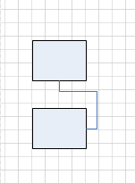

## **Connect Shapes**
This section explains how to connect two shapes using Aspose.Diagram for Java.
### **Connect Shapes**
The [connectShapesViaConnector](https://reference.aspose.com/diagram/java/com.aspose.diagram/page#connectShapesViaConnector(long,%20int,%20long,%20int,%20long)) method connect two shapes via a connector in the [Page](https://reference.aspose.com/diagram/java/com.aspose.diagram/Page) class.

The code below shows how to:

1. Create a diagram from stencil.
1. Add two rectangles shape to page.
1. Add a connector shape to page.
1. Connect the two rectangles with the connector using connectShapesViaConnector mothod
1. save diagram
#### **Connect Shapes Programming Sample**
Use the following code to connect shapes using Aspose.Diagram for Java.


// For complete examples and data files, please go to https://github.com/aspose-diagram/Aspose.Diagram-for-Java
// The path to the documents directory.
String dataDir = Utils.getDataDir(ConnectShapes.class);
String stencil = dataDir + "Basic Shapes.vss";

// create a diagram from stencil
Diagram diagram = new Diagram(stencil);
String connectorMaster = "Dynamic connector";
String rectangleMaster = "Rectangle";
// add two rectangles to page 0
long rectangle1 = diagram.addShape(2, 2, rectangleMaster, 0);
long rectangle2 = diagram.addShape(2, 4, rectangleMaster, 0);
// add a connector to page 0
Shape connector1 = new Shape();
long connecter1Id = diagram.addShape(connector1, connectorMaster, 0);
// connect the two rectangles with the connector
diagram.getPages().get(0).connectShapesViaConnector(rectangle1, ConnectionPointPlace.RIGHT, rectangle2, ConnectionPointPlace.BOTTOM, connecter1Id);

// If the connection of shapes has name, we also could use connection name to connect like below
//diagram.getPages().get(0).connectShapesViaConnector(shape1, "Port7", shape2, "Port21", connecter1Id);
// The code line above is equal to the below two lines
//diagram.getPages().get(0).glueShapeToConnectorBeginX(shape1, "Port7", connecter1Id);
//diagram.getPages().get(0).glueShapeToConnectorEndX(shape2, "Port21", connecter1Id);

// Save diagram
diagram.save(dataDir + "ConnectShapes_out.vsdx", SaveFileFormat.VSDX);



|**Result**|
| :- |
||