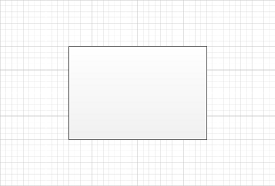

## **Calculate PinX and PinY Values of the Sub Shape**
If the shape is a children of group shape, it's xform is a relative coordinate of it's parent shape，but not absolute coordinate in the [Page](https://reference.aspose.com/diagram/java/com.aspose.diagram/page). If the user require to get the absolute coordinate, then this sample code helps.

A point specified in local coordinates can be converted into parent coordinates by applying the following transformations in the following order:

1. Subtract the value of the LocPinX property of the Cell_Type element from the x-coordinate.
1. Subtract the value of the LocPinY property of the Cell_Type from the y-coordinate.
1. Mirror the point about the y-axis if the value of the FlipX property of the Cell_Type is equal to one.
1. Mirror the point about the x-axis if the value of the FlipY property of the Cell_Type is equal to one.
1. Rotate the point counterclockwise around the origin by the value of the Angle property of the Cell_Type.
1. Add the value of the PinX Cell_Type to the x-coordinate.
1. Add the value of the PinY Cell_Type to the y-coordinate.
### **Calculate PinX and PinY Programming Sample**
Use the following code in your Java application to calculate PinX and PinY values of a sub-shape using Aspose.Diagram for Java API.


// For complete examples and data files, please go to https://github.com/aspose-diagram/Aspose.Diagram-for-Java
// The path to the documents directory.
String dataDir = Utils.getDataDir(CalculateCenterOfSubShapes.class);
        
// load Visio diagram
Diagram diagram = new Diagram(dataDir + "Drawing1.vsdx");
// get group shape
Shape shape = diagram.getPages().get(0).getShapes().getShape(138);
// get sub-shape of the group shape
Shape subShape = shape.getShapes().getShape(140);

AffineTransform m = new AffineTransform();
// apply the translation vector
m.translate(-(float)subShape.getXForm().getLocPinX().getValue(), -(float)subShape.getXForm().getLocPinY().getValue());		
// set the elements of that matrix to a rotation
m.rotate((float)subShape.getXForm().getAngle().getValue());
// apply the translation vector
m.translate((float)subShape.getXForm().getPinX().getValue(), (float)subShape.getXForm().getPinY().getValue());

// get pinx and piny		
double pinx = m.getTranslateX();
double piny = m.getTranslateY();
		
// calculate the sub-shape pinx and piny
double resultx = shape.getXForm().getPinX().getValue() - shape.getXForm().getLocPinX().getValue() - pinx;
double resulty = shape.getXForm().getPinY().getValue() - shape.getXForm().getLocPinY().getValue() - piny;



## **Setting Height and Width of a Shape**
The [Shape](https://reference.aspose.com/diagram/java/com.aspose.diagram/shape) Class allows you to control the shape size by specifying height and width of the shape using SetHeight and SetWidth methods.

The SetHeight and SetWidth methods, exposed by the [Shape](https://reference.aspose.com/diagram/java/com.aspose.diagram/Shape) class, support resizing a shape with the master, without the master or in the form of a group shape.

The code examples in this article set the Height and Width to resize the shape on the page.

**Input diagram** 

**The diagram after the Height and Width have been changed**

The process for setting Height and Width is:

1. Load a diagram.
1. Find a particular shape.
1. Set the height of a shape.
1. Set the Width of a shape.
1. Save the diagram.
### **Setting Height and Width Programming Sample**
The code snippet below shows how to set the shape's height and width. The code looks for a shape name rectangle, with the shape ID 1, and sets its Height and Width as double.


// For complete examples and data files, please go to https://github.com/aspose-diagram/Aspose.Diagram-for-Java
// The path to the documents directory.
String dataDir = Utils.getDataDir(ChangeShapeSize.class);
        
// call a Diagram class constructor to load the VSDX diagram
Diagram diagram = new Diagram(dataDir + "Drawing1.vsdx");
// get page by name
Page page = diagram.getPages().getPage("Page-1");
// get shape by id
Shape shape = page.getShapes().getShape(796);
// alter the size of Shape
shape.setWidth(2 * shape.getXForm().getWidth().getValue());
shape.setHeight(2 * shape.getXForm().getHeight().getValue());
// save diagram
diagram.save(dataDir + "ChangeShapeSize_Out.vsdx", SaveFileFormat.VSDX);



