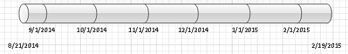
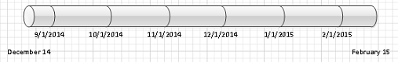

## **Set Milestone Shape Properties**
Aspose.Diagram allows developers to set milestone properties. This article shows how to set the milestone date, date format, auto update flag and type.
### **Setting Milestone Date, Date Format, Auto Update Flag and Type**
The [MilestoneHelper](https://reference.aspose.com/diagram/java/com.aspose.diagram/milestonehelper) class takes a [Shape](https://reference.aspose.com/diagram/java/com.aspose.diagram/shape) object while initializing the [MilestoneHelper](https://reference.aspose.com/diagram/java/com.aspose.diagram/milestonehelper) object. The code example in this article sets the milestone date, date format, auto update flag and milestone type properties.

|
**The milestone before update** 

\
|
**The milestone after update. Note the changed date format.** 

\
|
| :- | :- |
The process for updating the milestone date, date format, auto update flag and milestone type:

1. Load a diagram.
1. Find a particular shape.
1. Initialize the MilestoneHelper object.
1. Set a milestone date.
1. Set the milestone date format.
1. Set an auto update flag.
1. Set the milestone type
1. Save the Visio drawing to any supported format.
#### **Set Milestone Programming Sample**


Table of date format values:

|**Value**|**Format String**|
| :- | :- |
|0|dddd, yyyy-M-d|
|1|yyyy-MM-dd|
|2|yy-MMM-d|
|3|yyyy/M/d|
|4|yy-MMM.-d|
|5|d MMMM yyyy|
|6|yy-M|
|7|MMM-yy|
|8|MMMM d, yyyy|
|9|MMM d, yyyy|
|10|M-d-yy|
|11|M-d|
|12|d MMMM, yyyy|
|13|d MMM, yyyy|
|14|d-M-yy|
|15|d-M|
|16|yy-M-d|
|17|yyyy-M-d|
|18|M-yy|
|19|M-yyyy|
|20|MMMM yyyy|
|21|MMMM yy|
|22|MMM yyyy|
|23|MMM yy|
|24|yy|
|25|yyyy|
|26|d|
|27|MMMM|
|28|MMM|
|29|M|
## **Set Time Period and Date Format of Timeline Shape**
Aspose.Diagram allows developers to configure the timeline programmatically. This explains how to adjust the time period and date format of timeline shapes (block, line, ruler, divided, or cylindrical).
### **Setting Time Period and Date Format**
The [TimeLineHelper](https://reference.aspose.com/diagram/java/com.aspose.diagram/timelinehelper) class takes a [Shape](https://reference.aspose.com/diagram/java/com.aspose.diagram/Shape) object when initializing the [TimeLineHelper](https://reference.aspose.com/diagram/java/com.aspose.diagram/timelinehelper) object. The code example in this article sets the time period start, end and date format values.

|
**The time period tab of the Visio Configure Timeline dialog** 

|
**The time format tab of the Visio Configure Timeline dialog** 

|
| :- | :- |
|
**Input diagram** 

|
**The diagram after the values have been changed** 

|
The process for updating time period start, end and date format is:

1. Load a diagram.
1. Find a particular shape.
1. Initialize the TimeLineHelper object.
1. Set the time period start.
1. Set the time period end.
1. Set a date format.
1. Save the Visio drawing to any supported format.
#### **Set Time Period and Date Programming Sample**


Table of date format values:

|**Value**|**Format String**|
| :- | :- |
|0|dddd, yyyy-M-d|
|1|yyyy-MM-dd|
|2|yy-MMM-d|
|3|yyyy/M/d|
|4|yy-MMM.-d|
|5|d MMMM yyyy|
|6|yy-M|
|7|MMM-yy|
|8|MMMM d, yyyy|
|9|MMM d, yyyy|
|10|M-d-yy|
|11|M-d|
|12|d MMMM, yyyy|
|13|d MMM, yyyy|
|14|d-M-yy|
|15|d-M|
|16|yy-M-d|
|17|yyyy-M-d|
|18|M-yy|
|19|M-yyyy|
|20|MMMM yyyy|
|21|MMMM yy|
|22|MMM yyyy|
|23|MMM yy|
|24|yy|
|25|yyyy|
|26|d|
|27|MMMM|
|28|MMM|
|29|M|
## **Refresh Milestones on the Timeline in Visio**
Aspose.Diagram allows developers to adjust milestones on the timeline shapes (block, line, ruler, divided, or cylindrical) according to the time period change.
### **Refresh Milestones on the Timeline using TimeLineHelper class**
The RefreshTimeLine method exposed by the [TimeLineHelper](https://reference.aspose.com/diagram/java/com.aspose.diagram/timelinehelper) class can be used to revive milestones on the timeline.

The code below shows how to:

1. load a sample diagram.
1. get a timeline shape.
1. initialize the TimeLineHelper object.
1. set the time period start.
1. set the time period end.
1. set date format (optional).
1. call RefreshTimeLine method of the TimeLineHelper object.
1. save diagram
#### **Refresh Milestones using TimeLineHelper Programming Sample**
Use the following code in your Java application to revive milestones on the timeline using Aspose.Diagram for Java.


### **Refresh Milestones on the Timeline using MilestoneHelper class**
The RefreshMilestone method exposed by the [MilestoneHelper](https://reference.aspose.com/diagram/java/com.aspose.diagram/milestonehelper) class can be used to refresh milestones on the timeline.

The code below shows how to:

1. load a sample diagram.
1. get a timeline shape.
1. add Shape in Visio diagram using AddShape method.
1. initialize the MilestoneHelper object.
1. set Milestone Date.
1. set Milstone's IsAutoUpdate property to true.
1. call RefreshMilestone method of the MilestoneHelper object.
1. save diagram
#### **Refresh Milestones using MilestoneHelper Programming Sample**
Use the following code in your Java application to refresh milestones on the timeline using Aspose.Diagram for Java.


