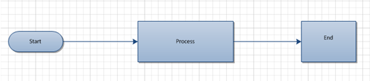
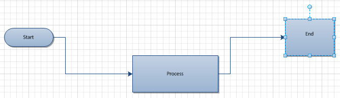

## **Setting XForm Data**
The XForm element is part of the Microsoft Visio XML schema. XForm specifies a shapes position, for example width, height, rotation and whether the shape has been flipped. The [XForm](https://reference.aspose.com/diagram/java/com.aspose.diagram/xform) property, exposed by the [Shape](https://reference.aspose.com/diagram/java/com.aspose.diagram/shape) class, supports the Aspose.Diagram.XForm object. The XForm property can be used to retrieve or update a shape's XForm data. The code examples in this article change the PinX (X-coordinate) and PinY (Y-coordinate) XForm values to move the shapes on the page.

**Input diagram** 



**The diagram after the** **PinX** **and** **PinY** **values have been changed** 



The process for updating XForm data is:

1. Load a diagram.# Find a particular shape.# Update the shape's XForm data.
1. Save the diagram.
### **Programming Sample**
The code snippet below shows how to update a shape's XForm data. The code looks for a shape names process, with the shape ID 1, and sets its X and Y coordinates to 5.

```

// For complete examples and data files, please go to https://github.com/aspose-diagram/Aspose.Diagram-for-Java
// The path to the documents directory.
String dataDir = Utils.getDataDir(SetXFormdata.class); 
// call a Diagram class constructor to load the VSD diagram
Diagram diagram = new Diagram(dataDir + "SetXFormdata.vsd");

//Find a particular shape and update its XForm
for(Shape shape :(Iterable<Shape>) diagram.getPages().get(0).getShapes())
{
    if (shape.getNameU().toLowerCase() == "process" && shape.getID() == 1)
    {
        shape.getXForm().getPinX().setValue(5);
        shape.getXForm().getPinY().setValue(5);
    }
}
// save diagram
diagram.save(dataDir + "SetXFormdata_Out.vsdx", SaveFileFormat.VSDX);


```
## **Set Visio Shape's Line Data**
Shapes can be formatted in several ways. This article shows how to specify a line's attributes.

Microsoft Visio lets users format lines in various ways. Aspose.Diagram for Java supports:

- Weight: a line's thickness.
- Color: set shape's line color.
- Line Color Transparency: set shape's line color transparency in percentage.
- Pattern: defines whether the line is solid, dashed or has another pattern.
- Rounding: the radius of corners.
- Beginning and ending arrows: specified whether the line has arrows.
- Beginning and ending arrow sizes: set the arrow sizes.
- Cap: the rounding of the line ends.
### **Change the line color, weight, dash type, transparency, rounding, arrow type and arrow size of a shape's border**
The [Line](https://reference.aspose.com/diagram/java/com.aspose.diagram/line) property, exposed by the [Shape](https://reference.aspose.com/diagram/java/com.aspose.diagram/shape) class, supports the Aspose.Diagram.Line object. This property can be used to retrieve or update a shape's line data.
#### **Line Data Programming Sample**
The following piece of code updates the line data of shape.

```

// For complete examples and data files, please go to https://github.com/aspose-diagram/Aspose.Diagram-for-Java
// The path to the documents directory.
String dataDir = Utils.getDataDir(SetLineData.class);

// load a Visio diagram
Diagram diagram = new Diagram(dataDir + "SetLineData.vsd");
// get the page by its name
Page page1 = diagram.getPages().getPage("Page-1");
// get shape by its ID
Shape shape = page1.getShapes().getShape(1);
// set line dash type by index
shape.getLine().getLinePattern().setValue(4);
// set line weight, defualt in PT
shape.getLine().getLineWeight().setValue(2);
// set color of the shape's line
shape.getLine().getLineColor().getUfe().setF("RGB(95,108,53)");
// set line rounding, default in inch
shape.getLine().getRounding().setValue(0.3125);
// set line caps
shape.getLine().getLineCap().setValue(BOOL.TRUE);
// set line color transparency in percent
shape.getLine().getLineColorTrans().setValue(50);

/* add arrows to the connector or curve shapes */
// select arrow type by index
shape.getLine().getBeginArrow().setValue(4);
shape.getLine().getEndArrow().setValue(4);
// set arrow size 
shape.getLine().getBeginArrowSize().setValue(ArrowSizeValue.LARGE);
shape.getLine().getBeginArrowSize().setValue(ArrowSizeValue.LARGE);

// save the Visio
diagram.save(dataDir + "SetLineData_Out.vsdx", SaveFileFormat.VSDX);
// save diagram
diagram.save(dataDir+ "output.vdx", SaveFileFormat.VDX);


```
## **Set Visio Shape's Fill Data**
Shapes can be formatted in several ways. This topic describes how to specify a shape's fill.

Microsoft Office Visio lets users format fills in various ways. The [Fill](https://reference.aspose.com/diagram/java/com.aspose.diagram/fill) class of the Aspose.Diagram for Java API supports setting:

- Background and foreground colors.
- Transparency.
- Fill patterns.
- Shadows.
### **Setting Fill Values**
The Fill property, exposed by the Shape class, supports the Aspose.Diagram.Fill object. The Fill property can be used to retrieve or update a shape's fill data.

|<p>**The input diagram** </p><p></p>|<p>**The diagram after changing the fill color** </p><p></p>|
| :- | :- |
#### **Fill Data Programming Sample**
The following code snippet updates a shape's fill data. The code looks for a shape named rectangle, with the shape ID 1, and sets the fill background and foreground colors.

```

// For complete examples and data files, please go to https://github.com/aspose-diagram/Aspose.Diagram-for-Java
// The path to the documents directory.
String dataDir = Utils.getDataDir(SetFillData.class);


//Call the diagram constructor to load diagram from a VDX file
Diagram diagram = new Diagram(dataDir+ "Drawing1.vsd");

//Find a particular shape and update its XForm
for (com.aspose.diagram.Shape shape : (Iterable<Shape>) diagram.getPages().get(0).getShapes())
{
    if (shape.getNameU().toLowerCase() == "rectangle" && shape.getID() == 1)
    {
        shape.getFill().getFillBkgnd().setValue(diagram.getPages().getPage(0).getShapes().getShape(0).getFill().getFillBkgnd().getValue());
        shape.getFill().getFillForegnd().setValue("#ebf8df");
    }
}
// save diagram
diagram.save(dataDir+ "SetFillData_Out.vsdx", SaveFileFormat.VSDX);


```
### **Retrieve Inherited Fill Data of a Visio Shape**
The Visio shapes can inherit the parent style and the master shape. Developers may get or set the inherit fill data of a Visio shape. The InheritFill property, exposed by the Shape class, contains the fill formatting values for the shape inherit by the parent style and the master shape.
#### **Retrieve Inherited Fill Data Programming Sample**
The following code snippet retrieves the inherited fill data of the shape. Please check this sample code:

```

// For complete examples and data files, please go to https://github.com/aspose-diagram/Aspose.Diagram-for-Java
// The path to the documents directory.
String dataDir = Utils.getSharedDataDir(RetrieveInheritedFillData.class) + "Shapes/";

// Call the diagram constructor to load a VSDX diagram
Diagram diagram = new Diagram(dataDir + "Drawing1.vsdx");

// Get page by ID
Page page = diagram.getPages().getPage("Page-1");
// Get shape by ID
Shape shape = page.getShapes().getShape(1);
// Get the fill formatting values
System.out.println(shape.getInheritFill().getFillBkgnd().getValue());
System.out.println(shape.getInheritFill().getFillForegnd().getValue());
System.out.println(shape.getInheritFill().getFillPattern().getValue());
System.out.println(shape.getInheritFill().getShapeShdwObliqueAngle().getValue());
System.out.println(shape.getInheritFill().getShapeShdwOffsetX().getValue());
System.out.println(shape.getInheritFill().getShapeShdwOffsetY().getValue());
System.out.println(shape.getInheritFill().getShapeShdwScaleFactor().getValue());
System.out.println(shape.getInheritFill().getShapeShdwType().getValue());
System.out.println(shape.getInheritFill().getShdwBkgnd().getValue());
System.out.println(shape.getInheritFill().getShdwBkgndTrans().getValue());
System.out.println(shape.getInheritFill().getShdwForegnd().getValue());
System.out.println(shape.getInheritFill().getShdwForegndTrans().getValue());
System.out.println(shape.getInheritFill().getShdwPattern().getValue());


```
