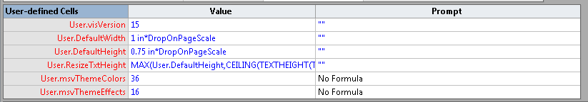
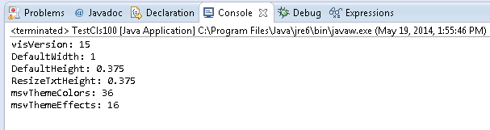

## **Read User-defined Cells of the Visio Shapes**
Users insert text fields into shapes to display additional information. **User-defined Cells** is the one branch of these fields and this branch uses information entered in the Value cell of the User-defined Cells section in the shape's ShapeSheet. Developers can insert and read all user defined cells using [Aspose.Diagram for Java API](https://products.aspose.com/diagram/java/).

The Users collection exposed by the [Shape](https://reference.aspose.com/diagram/java/com.aspose.diagram/Shape) class supports the com.aspose.diagram.User object. The [User](https://reference.aspose.com/diagram/java/com.aspose.diagram/User) class can be used to read properties. There are a few user-defined cells as you can see in the following image:

**Table showing information about user defined cells** 

The following code is used to read user-defined cells.

The following image shows the output after running the code: 

#### **Programming Samples**


// For complete examples and data files, please go to https://github.com/aspose-diagram/Aspose.Diagram-for-Java
// The path to the documents directory.
String dataDir = Utils.getDataDir(ReadUserdefinedCellsOfShape.class);  
// load source Visio diagram
Diagram diagram = new Diagram(dataDir + "Drawing1.vsdx");
// get page by name
Page page = diagram.getPages().getPage("Page-1");
// get shape by id
Shape shape = page.getShapes().getShape(1);
// extract user defined cells of the shape
for (User user :(Iterable<User>) shape.getUsers())
{
    System.out.println(user.getName() + ": " + user.getValue().getVal());
}



### **Create User-defined Cell**
The Aspose.Diagram for Java API allows developers to create user-defined cell in the shapesheet. This example topic describes how to add as many user name rows as are needed, assign meaningful names to the rows, and set cell values.

The add method exposed by the Users collection can be used to create user-defined cell in the shapesheet. It takes a single parameter.

Use the following code in your Java application to create user-defined cell in the shapesheet using Aspose.Diagram for Java.
#### **Programming Samples**


// For complete examples and data files, please go to https://github.com/aspose-diagram/Aspose.Diagram-for-Java
// The path to the documents directory.
String dataDir = Utils.getDataDir(CreateUserDefinedCellInShapeSheet.class);  
// load source Visio diagram
Diagram diagram = new Diagram(dataDir + "Drawing1.vsdx");
// get page by name
Page page = diagram.getPages().getPage("Page-1");
// get shape by id
Shape shape = page.getShapes().getShape(2);
        
// initialize user object
User user = new User();
user.setName("UserDefineCell");
user.getValue().setVal("800");
// add user-defined cell
shape.getUsers().add(user);

// save diagram
diagram.save(dataDir + "CreateUserDefinedCellInShapeSheet_Out.vsdx", SaveFileFormat.VSDX);



## **Retrieve User-defined Cells from Shapesheet**
Aspose.Diagram for Java API allows developers to retrieve user-defined cells from shapesheet. This example topic describes how to retrieve all user names for all shapes in a drawing.
### **Retrieve User-defined Cells**
The getNameU(), getValue().getVal() and getPrompt().getValue() methods exposed by the [User](https://reference.aspose.com/diagram/java/com.aspose.diagram/User) class can be used to retrieve user-defined cells from shapesheet.
#### **Retrieve Cells from Shapesheet Programming Samples**
Use the following code in your Java application to retrieve all user-defined cells from shapesheet using Aspose.Diagram for Java.
#### **Programming Samples**


// For complete examples and data files, please go to https://github.com/aspose-diagram/Aspose.Diagram-for-Java
// The path to the documents directory.
String dataDir = Utils.getDataDir(CreateUserDefinedCellInShapeSheet.class);  
// load source Visio diagram
Diagram diagram = new Diagram(dataDir + "Drawing1.vsdx");
// get page by name
Page page = diagram.getPages().getPage("Page-1");
// get shape by id
Shape shape = page.getShapes().getShape(2);
        
// initialize user object
User user = new User();
user.setName("UserDefineCell");
user.getValue().setVal("800");
// add user-defined cell
shape.getUsers().add(user);

// save diagram
diagram.save(dataDir + "CreateUserDefinedCellInShapeSheet_Out.vsdx", SaveFileFormat.VSDX);



