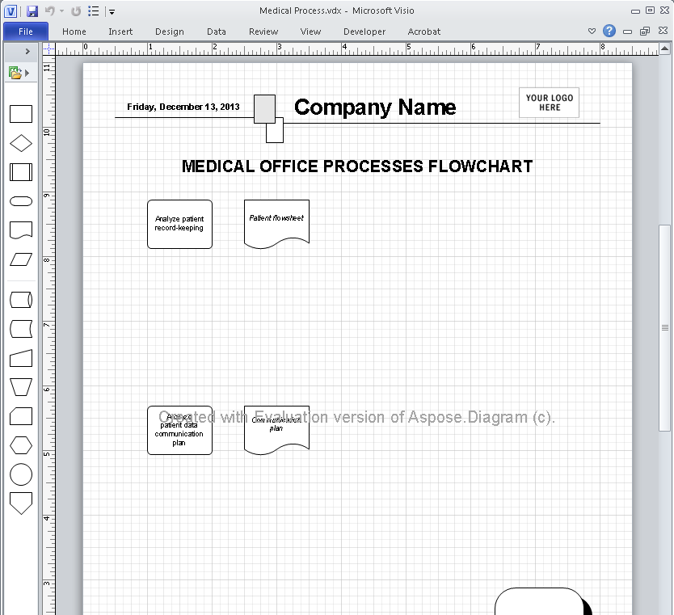

{} 

Developers can easily [download Aspose.Diagram for Java API](https://downloads.aspose.com/diagram/java) for evaluation purposes. The evaluation download is the same as the purchased download. The evaluation version simply becomes licensed when developers add a couple of lines of code to [apply the license](/diagram/java/licensing/#applying-a-license). The evaluation version of Aspose.Diagram has some [evaluation version limitations](/diagram/java/licensing/#evaluation-version-limitations), and also inserts an evaluation watermark at the top of the document on open and save, and limits to read only the first ten shapes of first page of the Visio diagram.

To test Aspose.Diagram without the evaluation version limitations, please [request a 30-day temporary license](https://purchase.aspose.com/temporary-license).

**Aspose.Diagram for Java injects a watermark when working in evaluation mode** 

{}
