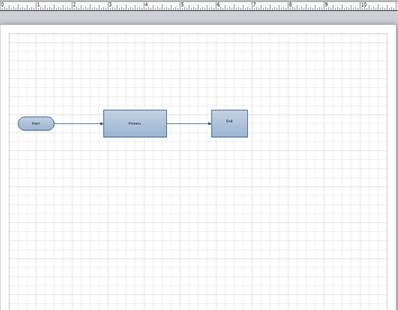

## **Export to XML**
### **Export Microsoft Visio Drawing to PDF**
The code samples show how to export Microsoft Visio Drawing to PDF using C#.


// For complete examples and data files, please go to https://github.com/aspose-diagram/Aspose.Diagram-for-.NET
// The path to the documents directory.
string dataDir = RunExamples.GetDataDir_LoadSaveConvert();

// Call the diagram constructor to load a VSD diagram
Diagram diagram = new Diagram(dataDir + "ExportToPDF.vsd");

MemoryStream pdfStream = new MemoryStream();
// Save diagram
diagram.Save(pdfStream, SaveFileFormat.PDF);

// Create a PDF file
FileStream pdfFileStream = new FileStream(dataDir + "ExportToPDF_out.pdf", FileMode.Create, FileAccess.Write);
pdfStream.WriteTo(pdfFileStream);
pdfFileStream.Close();

pdfStream.Close();

// Display Status.
System.Console.WriteLine("Conversion from vsd to pdf performed successfully.");



This article explains how to export a Microsoft Visio diagram to XML using [Aspose.Diagram for .NET](http://www.aspose.com/.net/diagram-component.aspx) API.

- VDX defines an XML diagram.
- VTX defines an XML template.
- VSX defines an XML stencil.

The [Diagram](http://www.aspose.com/api/net/diagram/aspose.diagram/diagram) class' constructors read a diagram and the Save method is used to save, or export, a diagram in a different file format. The code snippets in this article show how to use the Save method to save a Visio file to [VDX](https://docs.aspose.com/diagram/net/save-visio-document/), [VTX](https://docs.aspose.com/diagram/net/save-visio-document/) and [VSX](https://docs.aspose.com/diagram/net/save-visio-document/).

The image below shows the diagram that is exported in the code snippets below. The exported file is shown before each code snippet.

|**A Microsoft Visio diagram about to be exported.**|
| :- |
||

### **Export VSD to VDX**
VDX is a schema-based XML file format that lets you save diagrams in a format that products other than Microsoft Visio can read. It's a useful format for transferring diagrams between software applications and retaining editable data.

To export a VSD diagram to VDX:

1. Create an instance of the Diagram class.
1. Call the Diagram class' Save method to write the Visio drawing file to VDX.

|**The exported VDX file.**|
| :- |
||

### **Export from VSD to VSX**
VSX is an XML format for defining stencils, the basic objects from which a diagram is built up. When a Visio file is converted to VSX, only the stencils are exported.

To export a VSD diagram to VSX:

- Create an instance of the Diagram class.
- Call the Diagram class' Save method to write the Visio drawing file to VSX.
### **Export VSD to VTX**
TVX is an XML representation of a template file and stores the settings for the document.

To export a VSD diagram to VTX:

1. Create an instance of the Diagram class.
1. Call the diagram class' Save method to write the Visio drawing file in the VTX format.
### **Export Microsoft Visio Drawing to XML**
The code samples show how to export Microsoft Visio Drawing to XML using C#.


// For complete examples and data files, please go to https://github.com/aspose-diagram/Aspose.Diagram-for-.NET
// The path to the documents directory.
string dataDir = RunExamples.GetDataDir_LoadSaveConvert();
            
/* 1. Exporting VSDX to VDX */
// Call the diagram constructor to load diagram from a VSD file
Diagram diagram = new Diagram(dataDir + "ExportToXML.vsd");

// Save input VSD as VDX
diagram.Save(dataDir + "ExportToXML_out.vdx", SaveFileFormat.VDX);

/* 2. Exporting from VSD to VSX */
// Call the diagram constructor to load diagram from a VSD file
            
// Save input VSD as VSX
diagram.Save(dataDir + "ExportToXML_out.vsx", SaveFileFormat.VSX);
            
/* 3. Export VSD to VTX */
// Save input VSD as VTX
diagram.Save(dataDir + "ExportToXML_out.vtx", SaveFileFormat.VTX);



## **Export to XPS**
This article explains how to export a Microsoft Visio diagram to XPS using [Aspose.Diagram for .NET](https://products.aspose.com/diagram/net/) API.
Use the [Diagram](http://www.aspose.com/api/net/diagram/aspose.diagram/diagram) class' constructor to read the diagram files and the Save method to export the diagram to any supported image format.

The code snippets in this article takes the diagram below as an input. You can use other diagram formats (VSS, VSSX, VSSM, VDX, VST, VSTX, VDX, VTX or VSX) as well.

|**The source document.**|
| :- |
||

To export VSD diagram to XPS:

1. Create an instance of the Diagram class.
1. Call the Diagram class' Save method and set XPS as the output format.
### **Export Microsoft Visio Drawing to XPS**
The code samples show how to export Microsoft Visio Drawing to XPS using C#.


// For complete examples and data files, please go to https://github.com/aspose-diagram/Aspose.Diagram-for-.NET
// The path to the documents directory.
string dataDir = RunExamples.GetDataDir_Diagrams();

// Open a VSD file
Diagram diagram = new Diagram(dataDir + "LayOutShapesInCompactTreeStyle.vdx");

// Save diagram to an XPS format
diagram.Save(dataDir + "ExportToXPS_out.xps", SaveFileFormat.XPS);



## **Export a Diagram to SVG**
This article explains how to export a Microsoft Visio diagram to SVG (Scalable Vector Graphics) using [Aspose.Diagram for .NET](http://www.aspose.com/.net/diagram-component.aspx) API.

Use the [Diagram](http://www.aspose.com/api/net/diagram/aspose.diagram/diagram) class' constructor to read the diagram files and the Save method to export the diagram to any supported image format.

To export VSD diagram to SVG, perform the following steps:

1. Create an instance of the Diagram class.
1. Call the class' Save method and set SVG as the export format.
### **Export Microsoft Visio Drawing to SVG**
The code samples show how to export a diagram to SVG using C#.


// For complete examples and data files, please go to https://github.com/aspose-diagram/Aspose.Diagram-for-.NET
// The path to the documents directory.
string dataDir = RunExamples.GetDataDir_LoadSaveConvert();

// Call the diagram constructor to load a VSD diagram
Diagram diagram = new Diagram(dataDir + "ExportToSVG.vsd");

// Save SVG Output file
diagram.Save(dataDir + "Output.svg", SaveFileFormat.SVG);



## **Export to SWF**
This article explains how to export a Microsoft Visio diagram to SWF using [Aspose.Diagram for .NET](http://www.aspose.com/.net/diagram-component.aspx) API.

Use the [Diagram](http://www.aspose.com/api/net/diagram/aspose.diagram/diagram) class' constructors to read the diagram files and then the Diagram class' Save method to export the diagram to SWF format. The image below shows the input VSD file that the code renders to SWF. You can use other diagram formats (VSS, VSSX, VSSM, VDW, VDX, VST, VSTX, VSTM, VDX, VTX or VSX) as well.

|**Input diagram.**|
| :- |
||

After the code, there's an image of the output.

To export VSD diagram to SWF::

- Create an instance of the Diagram class.
- Call the Diagram class' Save method and provide SWF format to export your diagram to SWF.
### **Embedded Viewer Programming Sample**


// For complete examples and data files, please go to https://github.com/aspose-diagram/Aspose.Diagram-for-.NET
// The path to the documents directory.
string dataDir = RunExamples.GetDataDir_Diagrams();
// Load diagram
Diagram diagram = new Diagram(dataDir + "ActvDir.vsd");
// Save diagram
diagram.Save(dataDir + "Output_out.swf", SaveFileFormat.SWF);



### **Without Viewer Programming Sample**
The SWF file created by these code snippets include an SWF viewer. Exclude the SWF viewer from the file using the following code.


// For complete examples and data files, please go to https://github.com/aspose-diagram/Aspose.Diagram-for-.NET
// The path to the documents directory.
string dataDir = RunExamples.GetDataDir_Diagrams();

// Instantiate Diagram Object and open VSD file
Diagram diagram = new Diagram(dataDir + "ExportToSWFWithoutViewer.vsd");

// Instantiate the Save Options
SWFSaveOptions options = new SWFSaveOptions();

// Set Save format as SWF
options.SaveFormat = SaveFileFormat.SWF;

// Exclude the embedded viewer
options.ViewerIncluded = false;

// Save the resultant SWF file
diagram.Save(dataDir + "ExportToSWFWithoutViewer_out.swf", SaveFileFormat.SWF);



## **Export a Diagram to XAML**
This article explains how to export a Microsoft Visio diagram to XAML (Extensible Application Markup Language) using [Aspose.Diagram for .NET](https://products.aspose.com/diagram/net/) API.

Use the [Diagram](http://www.aspose.com/api/net/diagram/aspose.diagram/diagram) class' constructor to read the diagram files and the Save method to export the diagram to any supported image format.

To export a VSD diagram to XAML:

1. Create an instance of the Diagram class.
1. Call the class' Save method and set XAML as the export format.
### **Export Microsoft Visio Drawing to XAML**
The code sample show how to export a diagram to XAML using C#.


// For complete examples and data files, please go to https://github.com/aspose-diagram/Aspose.Diagram-for-.NET
// The path to the documents directory.
string dataDir = RunExamples.GetDataDir_LoadSaveConvert();
// Load diagram
Diagram diagram = new Diagram(dataDir + "ExportToXAML.vsd");
// Save diagram
diagram.Save(dataDir + "ExportToXAML_out.xaml", SaveFileFormat.XAML);



## **Convert Visio Drawing with Selective Shapes**
Using Aspose.Diagram API, developers can select a group of shapes to convert a Visio drawing into any other supported format. RenderingSaveOptions class offers a Shapes member to maintain the group of shapes. Each save option class is the extended form of RenderingSaveOptions class.

To export a Visio drawing with selective shapes:

1. Create an instance of the Diagram class.
1. Create an instance of any SaveOption class to specify settings as narrated here: [Specify Visio Save Options](https://docs.aspose.com/diagram/net/save-visio-document/#specifying-visio-save-options)
1. Call Save method of the Diagram class object and pass save option class object as parameter.
### **Convert Visio Drawing with Selective Shapes Programming Sample**
The code sample shows how to export a drawing with selective Visio shapes.


// the path to the documents directory.
string dataDir = RunExamples.GetDataDir_LoadSaveConvert();

// call the diagram constructor to load diagram from a VSD file
Diagram diagram = new Diagram(dataDir + "Drawing1.vsdx");

// create an instance SVG save options class
SVGSaveOptions options = new SVGSaveOptions();
ShapeCollection shapes = options.Shapes;

// get shapes by page index and shape ID, and then add in the shape collection object
shapes.Add(diagram.Pages[0].Shapes.GetShape(1));
shapes.Add(diagram.Pages[0].Shapes.GetShape(2));

// save Visio drawing
diagram.Save(dataDir + "SelectiveShapes_out.svg", options);

