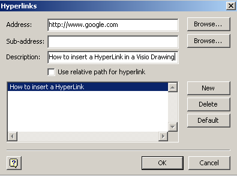
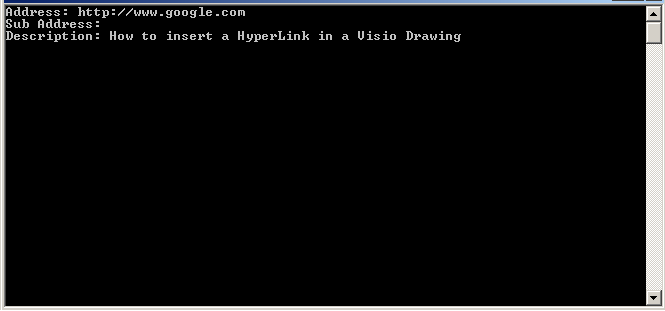

## **Add Hyperlink to a Visio Shape**
Microsoft Office Visio supports adding the hyperlinks to any shape. The hyperlinks can link to another page or shape in the current drawing, a page or shape in another drawing, a document other than a Visio drawing, a Web site, FTP site, or e-mail address. Developers can use Aspose.Diagram API to easily add hyperlinks to a Visio shape.

In the multi page Visio drawing, hyperlinks can navigate you from one shape to many other types of the links. [HyperlinkCollection](http://www.aspose.com/api/net/diagram/aspose.diagram/hyperlinkcollection) exposed by the [Shape](http://www.aspose.com/api/net/diagram/aspose.diagram/shape) class offers Add method which can be used to add a shape's hyperlink.

To identify properties in Microsoft Office Visio:

1. In a Visio diagram, right-click a shape.
1. Select **Hyperlink.**
1. Set existing properties
1. Press **OK** button

**A shape's hyperlink data, as seen in Microsoft Visio**


### **Add Hyperlink Programming Sample**
The code snippet below adds shape's hyperlink data.

```

// For complete examples and data files, please go to https://github.com/aspose-diagram/Aspose.Diagram-for-.NET
// The path to the documents directory.
string dataDir = RunExamples.GetDataDir_Hyperlinks();

// Load source Visio diagram
Diagram diagram = new Diagram(dataDir + "Drawing1.vsdx");
// Get page by name
Page page = diagram.Pages.GetPage("Page-1");
// Get shape by ID
Shape shape = page.Shapes.GetShape(2);

// Initialize Hyperlink object
Hyperlink hyperlink = new Hyperlink();
// Set address value
hyperlink.Address.Value = "http:// Www.google.com/";
// Set sub address value
hyperlink.SubAddress.Value = "Sub address here";
// Set description value
hyperlink.Description.Value = "Description here";
// Set name
hyperlink.Name = "MyHyperLink";

// Add hyperlink to the shape
shape.Hyperlinks.Add(hyperlink);            
// Save diagram to local space
diagram.Save(dataDir + "AddHyperlinkToShape_out.vsdx", SaveFileFormat.VSDX);


```
## **Get Hyperlinks Data of the Visio Shapes**
Developers can retrieve all hyperlinks from a Visio shape in the same way as they [read Visio shape data](https://docs.aspose.com/diagram/net/load-or-create-a-visio-drawing/) using [Aspose.Diagram for .NET API](https://products.aspose.com/diagram/net/).

In the multi page Visio drawing, hyperlinks can navigate you from one shape to many other types of the links. [HyperlinkCollection](http://www.aspose.com/api/net/diagram/aspose.diagram/hyperlinkcollection) exposed by the [Shape](http://www.aspose.com/api/net/diagram/aspose.diagram/shape) class allows developers to retrieve hyperlinks.

To identify properties in Microsoft Office Visio:

1. In a diagram, right-click a shape.
1. Select **Hyperlink.**

Any existing properties are listed in the dialog.
**A shape's hyperlink data, as seen in Microsoft Visio**


**A console window showing the shape data output**


### **Get Hyperlinks Programming Sample**
The code snippet below reads shape's hyperlink data.

```

// For complete examples and data files, please go to https://github.com/aspose-diagram/Aspose.Diagram-for-.NET
// The path to the documents directory.
string dataDir = RunExamples.GetDataDir_Hyperlinks();

// Load source Visio diagram
Diagram diagram = new Diagram(dataDir + "Drawing1.vsdx");
// Get page by name
Page page = diagram.Pages.GetPage("Page-1");
// Get shape by ID
Shape shape = page.Shapes.GetShape(1);
// Iterate through the hyperlinks
foreach (Aspose.Diagram.Hyperlink hyperlink in shape.Hyperlinks)
{
    Console.WriteLine("Address: " + hyperlink.Address.Value);
    Console.WriteLine("Sub Address: " + hyperlink.SubAddress.Value);
    Console.WriteLine("Description: " + hyperlink.Description.Value);
}       


```
