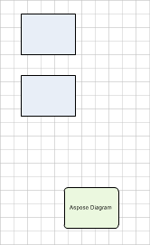
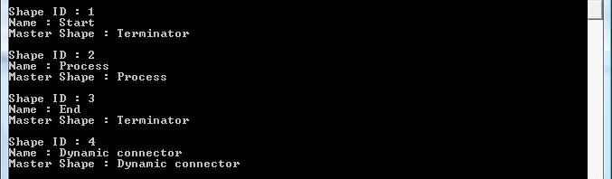
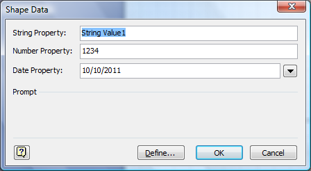
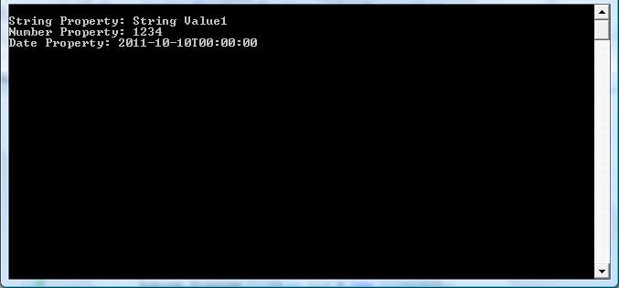

## **Adding a New Shape in Visio**
Aspose.Diagram for .NET allows you to manipulate Microsoft Visio diagrams in different ways. One of the things you can do is add new shapes to a diagrams. Aspose.Diagram for .NET lets you to add a new shape to a diagram. The added shape can also be customized using Aspose.Diagram for .NET.

This topic describes how to add a new rectangle shape to a diagram.

Use Aspose.Diagram for .NET API to create new shapes and then add these shapes to a diagram's shapes collection.

To add a new shape:

1. **Find the page** - Each Visio diagram contains a collection of pages. Developers may retrieve the page by page ID or Name and store the required page in the [Page](http://www.aspose.com/api/net/diagram/aspose.diagram/page) class object.
1. **Add the require Master of a Shape** - Each Visio diagram contains a collection of masters. Developers may add a Master (by ID or Name) from the existing stencil file (by direct path or file stream).
1. **Add shape in the Visio diagram** - Developers can place a new shape in the Visio diagram by page index (starting from 0), master name, PinX, PinY, height (optional) and width (optional).
1. **Set shape properties** - AddShape method of the Diagram class returns the shape ID. Developers can retrieve shape from a Visio diagram by using this ID, and then set its properties, e.g. color, position, alignment and text.

|
**The input diagram** 

|
**The diagram with a shape added** 

|
| :- | :- |
### **Add Programming Sample**
The code snippet below shows how to do each step.


// For complete examples and data files, please go to https://github.com/aspose-diagram/Aspose.Diagram-for-.NET
// The path to the documents directory.
string dataDir = RunExamples.GetDataDir_Shapes();

// Load a diagram
Diagram diagram = new Diagram(dataDir + "Drawing1.vsdx");
// Get page by name
Page page = diagram.Pages.GetPage("Page-2");

// Add master with stencil file path and master name
string masterName = "Rectangle";
diagram.AddMaster(dataDir + "Basic Shapes.vss", masterName);
            
// Page indexing starts from 0
int PageIndex = 1;
double width = 2, height = 2, pinX = 4.25, pinY = 4.5;
// Add a new rectangle shape
long rectangleId = diagram.AddShape(pinX, pinY, width, height, masterName, PageIndex);
            
// Set shape properties 
Shape rectangle = page.Shapes.GetShape(rectangleId);
rectangle.XForm.PinX.Value = 5;
rectangle.XForm.PinY.Value = 5;
rectangle.Type = TypeValue.Shape;
rectangle.Text.Value.Add(new Txt("Aspose Diagram"));
rectangle.TextStyle = diagram.StyleSheets[3];
rectangle.Line.LineColor.Value = "#ff0000";
rectangle.Line.LineWeight.Value = 0.03;
rectangle.Line.Rounding.Value = 0.1;
rectangle.Fill.FillBkgnd.Value = "#ff00ff";
rectangle.Fill.FillForegnd.Value = "#ebf8df";

diagram.Save(dataDir + "AddShape_out.vsdx", SaveFileFormat.VSDX);
Console.WriteLine("Shape has been added.");



{}

We welcome your queries and suggestions at [Aspose.Diagram Forum](https://forum.aspose.com/c/diagram/17). We'll reply promptly.

{}
## **Retrieving Shape Information**
[Working with Diagrams](/diagram/net/working-with-diagrams/) explains how to create diagrams, add shapes and connectors, and then how to retrieve information about diagram elements such as [pages](/diagram/net/retrieve-2c-get-2c-copy-and-insert-a-page/), [masters](https://docs.aspose.com/diagram/net/working-with-masters/), [connectors](/diagram/net/retrieving-connector-information/) and [fonts](/diagram/net/retrieving-font-information/). This article looks at how to retrieve information about shapes in a diagram.

Each shape in a diagram has an ID and a name. The ID is important when programming with Visio: it is the main method for accessing a shape. Each shape also retains information about what master (stencil) it is made from.

A [Shape](http://www.aspose.com/api/net/diagram/aspose.diagram/shape) is an object in a Visio drawing. The Shapes property, exposed by the Page class, supports a collection of Aspose.Diagram.Shape objects. The Shapes property can be used to retrieve information about a shape.

In the console window below, for example, you can see information output for a diagram that contained four shapes: two terminators, a process and a dynamic connector. Each has a unique ID as well as the name of the master (stencil) shape.

|**A console window showing shape information**|
| :- |
||
To retrieve Visio page information:

1. Loads a diagram.
1. Sets up a foreach loop to loop through all the shapes in the diagram.
1. Displays shape information.
### **Retrieve Programming Sample**
The following piece of code retrieve the shape information from a Visio diagram.


// For complete examples and data files, please go to https://github.com/aspose-diagram/Aspose.Diagram-for-.NET
// The path to the documents directory.
string dataDir = RunExamples.GetDataDir_Shapes();

// Load diagram
Diagram vsdDiagram = new Diagram(dataDir + "RetrieveShapeInfo.vsd");

foreach (Aspose.Diagram.Shape shape in vsdDiagram.Pages[0].Shapes)
{
    // Display information about the shapes
    Console.WriteLine("\nShape ID : " + shape.ID);
    Console.WriteLine("Name : " + shape.Name);
    Console.WriteLine("Master Shape : " + shape.Master.Name);
}



## **Copy Shapes from an Existing Visio**
Aspose.Diagram for .NET API allows developers to copy shapes from the source Visio page to the new Visio diagram page. It also supports copying group shapes. This article describes how to copy all shapes from the the source diagram page.

To copy shapes, developers should also copy source PageSheet and source Visio themes to preserve shape fill style and other formatting properties.

This example work as follows:

1. Load a source Visio.
1. Initialize a new Visio
1. Add masters and themes from the source Visio.
1. Get page from the source Visio.
1. Copy its PageSheet to the new Visio Page.
1. Iterate through the shapes of the source Visio page.
1. Set its new id and add to the new Visio page.
1. Save the new Visio in the local storage.
### **Copy Programming Sample**


// For complete examples and data files, please go to https://github.com/aspose-diagram/Aspose.Diagram-for-.NET
// The path to the documents directory.
string dataDir = RunExamples.GetDataDir_Shapes();
            
// Load a source Visio
Diagram srcVisio = new Diagram(dataDir + "Drawing1.vsdx");
            
// Initialize a new Visio
Diagram newDiagram = new Diagram();

// Add all masters from the source Visio diagram
MasterCollection originalMasters = srcVisio.Masters;
foreach (Master master in originalMasters)
    newDiagram.AddMaster(srcVisio, master.Name);

// Get the page object from the original diagram
Aspose.Diagram.Page SrcPage = srcVisio.Pages.GetPage("Page-1");
// Copy themes from the source diagram
newDiagram.CopyTheme(srcVisio);
// Copy pagesheet of the source Visio page
newDiagram.Pages[0].PageSheet.Copy(SrcPage.PageSheet);

// Copy shapes from the source Visio page
foreach (Aspose.Diagram.Shape shape in SrcPage.Shapes)
{
    newDiagram.Pages[0].Shapes.Add(shape);
}
// Save the new Visio
newDiagram.Save(dataDir + "CopyShapes_out.vsdx", SaveFileFormat.VSDX);



{}

We welcome your queries and suggestions at [Aspose.Diagram Forum](https://forum.aspose.com/c/diagram/17). We'll reply promptly.

{}
## **Copy a Visio Shape to another Shape instance**
The Copy method of the Shape class takes a shape instance to clone.



 // import diagram

Diagram diagram = new Diagram(dataDir + "Drawing1.vsdx");

Shape newShape = new Shape();

// copy diagram

newShape.Copy(diagram.Pages[0].Shapes[0]);

newShape.ID = 3;

newShape.XForm.PinX.Value = 1;

newShape.XForm.PinY.Value = 1;


## **Reading Visio Shape Data**
The Props collection exposed by the [Shape](http://www.aspose.com/api/net/diagram/aspose.diagram/shape) class supports the [Aspose.Diagram.Prop](http://www.aspose.com/api/net/diagram/aspose.diagram/prop) object. The property can be used to read a shape's data (custom properties).
### **Read All Shape Properties**
To identify custom properties in Microsoft Visio:

1. In a diagram, right-click a shape.
1. Select **Data**, then **Shape Data** from the menu.
   Any existing properties are listed in the dialog.

|**A shape's data, as seen in Microsoft Visio.**|** |
| :- | :- |
|| |

|**A console window showing the shape data output.**|** |
| :- | :- |
|| |
#### **Read Programming Sample**
The code snippets below reads shape data (custom properties).


// For complete examples and data files, please go to https://github.com/aspose-diagram/Aspose.Diagram-for-.NET
// The path to the documents directory.
string dataDir = RunExamples.GetDataDir_Shapes();

// Call a Diagram class constructor to load the VSDX diagram
Diagram diagram = new Diagram(dataDir + "Drawing1.vsdx");
// Get page by name
Page page = diagram.Pages.GetPage("Page-3");

foreach (Aspose.Diagram.Shape shape in page.Shapes)
{
    if (shape.Name == "Process1")
    {
        foreach (Prop property in shape.Props)
        {
            Console.WriteLine(property.Label.Value + ": " + property.Value.Val);
        }
        break;
    }
}



### **Read a Shape Property by Name**
The code snippet below reads a shape property by name (custom property).
#### **Read by Name Programming Sample**


// For complete examples and data files, please go to https://github.com/aspose-diagram/Aspose.Diagram-for-.NET
// The path to the documents directory.
string dataDir = RunExamples.GetDataDir_Shapes();

// Call a Diagram class constructor to load the VSDX diagram
Diagram diagram = new Diagram(dataDir + "Drawing1.vsdx");
// Get page by name
Page page = diagram.Pages.GetPage("Page-3");

foreach (Aspose.Diagram.Shape shape in page.Shapes)
{
    if (shape.Name == "Process1")
    {
        Prop property = shape.Props.GetProp("Name1");
        Console.WriteLine(property.Label.Value + ": " + property.Value.Val);
    }
}



### **Read InheritProps of Shape**
The code snippet below reads InheritProps of a shape. 


// For complete examples and data files, please go to https://github.com/aspose-diagram/Aspose.Diagram-for-.NET
// The path to the documents directory.
string dataDir = RunExamples.GetDataDir_Shapes();

// Call a Diagram class constructor to load the VSDX diagram
Diagram diagram = new Diagram(dataDir + "Drawing1.vsdx");
// Get page by name
Page page = diagram.Pages.GetPage("Page-3");

foreach (Aspose.Diagram.Shape shape in page.Shapes)
{
    foreach (Aspose.Diagram.Prop prop in shape.InheritProps)
    {
        Console.WriteLine(prop.Name);
        Console.WriteLine(prop.Label.Value);
        Console.WriteLine(prop.Prompt.Value);
        Console.WriteLine(prop.Type.Value.ToString());
        Console.WriteLine(prop.Value.Val);
        Console.WriteLine(prop.Format.Value);
    }
}



## **Add and Connect Visio Shapes**
Aspose.Diagram for .NET allows you to add customized shapes and connect them in [diagrams you create](https://products.aspose.com/diagram/net/).
### **Adding and Connecting Shapes**
The code in the samples below show how to:

1. Create a diagram.
1. Add and customize shapes (rectangle, star, hexagon).
1. Connect the star and hexagon shapes to the rectangle.
1. Save the diagram.
#### **Adding and Connecting Shapes Programming Sample**


// For complete examples and data files, please go to https://github.com/aspose-diagram/Aspose.Diagram-for-.NET
// The path to the documents directory.
string dataDir = RunExamples.GetDataDir_TechnicalArticles();

// Set license (you can add 10 shapes without setting a license)
// License lic = new License();
// Lic.SetLicense(dataDir + "Aspose.Total.lic");

// Load masters from any existing diagram, stencil or template
// And add in the new diagram
string visioStencil = dataDir + "AddConnectShapes.vss";

// Names of the masters present in the stencil
string rectangleMaster = @"Rectangle", starMaster = @"Star 7",
    hexagonMaster = @"Hexagon", connectorMaster = "Dynamic connector";

int pageNumber = 0;
double width = 2, height = 2, pinX = 4.25, pinY = 9.5;

// Create a new diagram
Diagram diagram = new Diagram(visioStencil);

// Add a new rectangle shape
long rectangleId = diagram.AddShape(
    pinX, pinY, width, height, rectangleMaster, pageNumber);

// Set the new shape's properties
Shape shape = diagram.Pages[pageNumber].Shapes.GetShape(rectangleId);
shape.Text.Value.Add(new Txt(@"Rectangle text."));
shape.Name = "Rectangle1";
shape.XForm.LocPinX.Ufe.F = "Width*0.5";
shape.XForm.LocPinY.Ufe.F = "Height*0.5";
shape.Line.LineColor.Value = "7";
shape.Line.LineWeight.Value = 0.03;
shape.Fill.FillBkgnd.Value = "1";
shape.Fill.FillForegnd.Value = "3";
shape.Fill.FillPattern.Value = 31;

// Add a new star shape
pinX = 2.0;
pinY = 4.5;
long starId = diagram.AddShape(
    pinX, pinY, width, height, starMaster, pageNumber);

// Set the star shape's properties
shape = diagram.Pages[pageNumber].Shapes.GetShape(starId);
shape.Text.Value.Add(new Txt(@"Star text."));
shape.Name = "Star1";
shape.XForm.LocPinX.Ufe.F = "Width*0.5";
shape.XForm.LocPinY.Ufe.F = "Height*0.5";
shape.Line.LineColor.Value = "#ff0000";
shape.Line.LineWeight.Value = 0.03;
shape.Fill.FillBkgnd.Value = "#ff00ff";
shape.Fill.FillForegnd.Value = "#0000ff";
shape.Fill.FillPattern.Value = 31;

// Add a new hexagon shape
pinX = 7.0;
long hexagonId = diagram.AddShape(
    pinX, pinY, width, height, hexagonMaster, pageNumber);

// Set the hexagon shape's properties
shape = diagram.Pages[pageNumber].Shapes.GetShape(hexagonId);
shape.Text.Value.Add(new Txt(@"Hexagon text."));
shape.Name = "Hexagon1";
shape.XForm.LocPinX.Ufe.F = "Width*0.5";
shape.XForm.LocPinY.Ufe.F = "Height*0.5";
shape.Line.LineWeight.Value = 0.03;
shape.Fill.FillPattern.Value = 31;

// Add master to dynamic connector from the stencil
diagram.AddMaster(visioStencil, connectorMaster);

// Connect rectangle and star shapes
Shape connector1 = new Shape();
long connecter1Id = diagram.AddShape(connector1, connectorMaster, 0);
diagram.Pages[0].ConnectShapesViaConnector(rectangleId, ConnectionPointPlace.Bottom,
    starId, ConnectionPointPlace.Top, connecter1Id);

// Connect rectangle and hexagon shapes
Shape connector2 = new Shape();
long connecter2Id = diagram.AddShape(connector2, connectorMaster, 0);
diagram.Pages[0].ConnectShapesViaConnector(rectangleId, ConnectionPointPlace.Bottom,
    hexagonId, ConnectionPointPlace.Left, connecter2Id);

// Save the diagram
diagram.Save(dataDir + "AddConnectShapes_out.vsdx", SaveFileFormat.VSDX);



## **Use Connection indexes to connect shapes**
Aspose.Diagram for .NET API already allows developers to add new connecting points on the shape, and developers can now connect shapes using connection indexes.
### **Use Connection indexes to connect shapes**
The ConnectShapesViaConnectorIndex member exposed by the [Page](https://reference.aspose.com/diagram/net/aspose.diagram/page) class can be used to connect shapes using connection indexes. The following code shows how to connect shapes:

1. Initialize a new drawing.
1. Place four rectangle shapes
1. Add two additional connection points, so that there would be three connection points on the bottom border line
1. Connect first shape from each bottom connection to other three rectangle shapes from Top with dynamic connectors
1. Save drawing
#### **Use connection indexes to connect shapes Programming Sample**
Use the following code in your .NET application to connect shapes using connection indexes with Aspose.Diagram for .NET API.

**C#**



 // initialize a new drawing

Diagram diagram = new Diagram();

// get page by index

Aspose.Diagram.Page page = diagram.Pages[0];

// add masters

string connectorMaster = "Dynamic connector", rectangle = "Rectangle";

int pageNumber = 0;

double width = 2, height = 2, pinX = 4.25, pinY = 9.5;

diagram.AddMaster(@"C:\temp\Basic Shapes.vss", rectangle);

diagram.AddMaster(@"C:\temp\Basic Shapes.vss", connectorMaster);

// add shapes

long shape1_ID = diagram.AddShape(4.5, 7, rectangle, pageNumber);

long shape2_ID = diagram.AddShape(2.25, 4.5, rectangle, pageNumber);

long shape3_ID = diagram.AddShape(4.5, 4.5, rectangle, pageNumber);

long shape4_ID = diagram.AddShape(6.75, 4.5, rectangle, pageNumber);

// get shapes by ID

Aspose.Diagram.Shape shape1 = page.Shapes.GetShape(shape1_ID);

Aspose.Diagram.Shape shape2 = page.Shapes.GetShape(shape2_ID);

Aspose.Diagram.Shape shape3 = page.Shapes.GetShape(shape3_ID);

Aspose.Diagram.Shape shape4 = page.Shapes.GetShape(shape4_ID);

// add two more connection points

Connection connection1 = new Connection();

connection1.X.Ufe.F = "Width*0.33";

connection1.Y.Ufe.F = "Height*0";

Connection connection3 = new Connection();

connection3.X.Ufe.F = "Width*0.66";

connection3.Y.Ufe.F = "Height*0";

shape1.Connections.Add(connection1);

shape1.Connections.Add(connection3);

// add connector shapes

Aspose.Diagram.Shape connector1 = new Aspose.Diagram.Shape();

Aspose.Diagram.Shape connector2 = new Aspose.Diagram.Shape();

Aspose.Diagram.Shape connector3 = new Aspose.Diagram.Shape();

long connecter1Id = diagram.AddShape(connector1, connectorMaster, 0);

long connecter2Id = diagram.AddShape(connector2, connectorMaster, 0);

long connecter3Id = diagram.AddShape(connector3, connectorMaster, 0);

// connect shapes by index of conneecting points

page.ConnectShapesViaConnectorIndex(shape1.ID, 6, shape2.ID, 3, connecter1Id);

page.ConnectShapesViaConnectorIndex(shape1.ID, 1, shape3.ID, 3, connecter2Id);

page.ConnectShapesViaConnectorIndex(shape1.ID, 7, shape4.ID, 3, connecter3Id);

// save drawing

diagram.Save(@"C:\temp\Drawing1_out.vsdx", SaveFileFormat.VSDX);


## **Retrieve the Parent Shape of a Sub-Shape**
Aspose.Diagram for .NET allows developers to retrieve the parent shape of a sub-shape.
### **Get the Parent Shape**
The [Shape](http://www.aspose.com/api/net/diagram/aspose.diagram/shape) class offers ParentShape property to retrieve the parent shape.
#### **Get the Parent Shape Programming Sample**


// The path to the documents directory.
string dataDir = RunExamples.GetDataDir_Shapes();
// Call a Diagram class constructor to load the VSD diagram
Diagram diagram = new Diagram(dataDir + "Drawing1.vsdx");
// get a sub-shape by page name, group shape ID, and then sub-shape ID
Shape shape = diagram.Pages.GetPage("Page-3").Shapes.GetShape(13).Shapes.GetShape(2);
Shape parentShape = shape.ParentShape;
Console.WriteLine("Parent Shape's Properties:");
Console.WriteLine("Shape ID: " + parentShape.ID);
Console.WriteLine("Shape Name: " + parentShape.Name);
Console.WriteLine("Shape Type: " + parentShape.Type);


