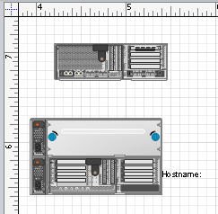
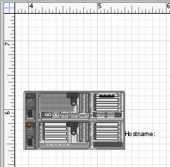
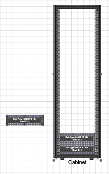

## **Get the Connectors Glued to a Particular Shape**
[Add and Connect Visio Shapes](https://docs.aspose.com/diagram/net/add-retrieve-copy-and-read-visio-shape-data/) explains how to add a shape and connect it to other shapes in Microsoft Visio diagrams using Aspose.Diagram for .NET. It is also possible to find connectors that are glued to this shape.
### **Getting Glued Shapes**
The GluedShapes method exposed by the [Shape](http://www.aspose.com/api/net/diagram/aspose.diagram/shape) class can be used to get a list of the IDs of all the connectors glued to a shape, or, if the shape in question is a connector, the IDs of the shapes it's connected to.The GetShape method, exposed by the [ShapeCollection](http://www.aspose.com/api/net/diagram/aspose.diagram/shapecollection) class, can then be used to find a shape by its ID.

The code below shows how to:

1. Load a sample file.
1. Access a particular shape.
1. Get a list of IDs of all the connectors glued to this shape.
#### **Get Connectors Glued Programming Sample**
Use the following code in your .NET application to find all the connectors glued to a shape using Aspose.Diagram for .NET.

```

// For complete examples and data files, please go to https://github.com/aspose-diagram/Aspose.Diagram-for-.NET
// The path to the documents directory.
string dataDir = RunExamples.GetDataDir_Shapes();

// Call a Diagram class constructor to load the VSD diagram
Diagram diagram = new Diagram(dataDir + "RetrieveShapeInfo.vsd");
// Get shape by an ID
Shape shape = diagram.Pages[0].Shapes.GetShape(90);
// Get all glued 1D shapes
long[] gluedShapeIds = shape.GluedShapes(GluedShapesFlags.GluedShapesAll1D, null, null);

// Display shape ID and name
foreach (long id in gluedShapeIds)
{
    shape = diagram.Pages[0].Shapes.GetShape(id);
    Console.WriteLine("ID: " + shape.ID + "\t\t Name: " + shape.Name);
}


```
## **Glue Visio Shapes Together with Connection Point**
Aspose.Diagram for .NET allows developers glue shapes together through the connection points.
### **Glue Shapes**
The GlueShapes method exposed by the [Page](http://www.aspose.com/api/net/diagram/aspose.diagram/page) class can be used.

|<p>**Input diagram** </p><p></p>|<p>**The diagram after gluing the shapes** </p><p></p>|
| :- | :- |
The code below shows how to:

1. Load a sample file.
1. Glue shapes.
1. Save diagram.
#### **Glue Visio Shapes Programming Sample**
Use the following code in your .NET application to glue shapes through the connection points:

```

// For complete examples and data files, please go to https://github.com/aspose-diagram/Aspose.Diagram-for-.NET
// The path to the documents directory.
string dataDir = RunExamples.GetDataDir_Shapes();

// Load diagram
Diagram diagram = new Diagram(dataDir + "Drawing1.vsdx");

// Get a particular page
Page page = diagram.Pages.GetPage("Page-1");
// Set shape id
long shape1_ID = 7;
long shape2_ID = 494;
// Glue shapes
page.GlueShapes(shape1_ID, Aspose.Diagram.Manipulation.ConnectionPointPlace.Center, shape2_ID);

// Save diagram
diagram.Save(dataDir + "GlueVisioShapes_out.vsdx", SaveFileFormat.VSDX);


```
## **Glue Shapes Inside the Container**
Aspose.Diagram for .NET enables developers to glue group shapes inside a container.
### **Glue Group Shape**
The GlueShapesInContainer method exposed by the [Page](http://www.aspose.com/api/net/diagram/aspose.diagram/page) class can be used.

|<p>**Input diagram** </p><p></p>|<p>**The diagram after gluing the group shapes** </p><p></p>|
| :- | :- |
The code below shows how to:

1. Load a sample file.
1. Glue group shapes.
1. Save diagram.
#### **Glue Shapes Inside Programming Sample**
Use the following code in your .NET application to glue group shape inside a container:

```

// For complete examples and data files, please go to https://github.com/aspose-diagram/Aspose.Diagram-for-.NET
// The path to the documents directory.
string dataDir = RunExamples.GetDataDir_Shapes();

// Load diagram
Diagram diagram = new Diagram(dataDir + "Drawing1.vsdx");

// Get a particular page
Page page = diagram.Pages.GetPage("Page-1");

// The ID of shape which is glue from Aspose.Diagram.Shape.
long shapeFromId = 779;
// The location on the first connection index where to glue
int shapeToBeginConnectionIndex = 72;
// The location on the end connection index where to glue
int shapeToEndConnectionIndex = 73;
// The ID of shape where to glue to Aspose.Diagram.Shape.
long shapeToId = 743;

// Glue shapes in container
page.GlueShapesInContainer(shapeFromId, shapeToBeginConnectionIndex, shapeToEndConnectionIndex, shapeToId);

// Glue shapes in container using connection name
// Page.GlueShapesInContainer(fasId, "U05L", "U05R", cabinetId1);

// Save diagram
diagram.Save(dataDir + "GlueContainerShape_out.vsdx", SaveFileFormat.VSDX);


```
