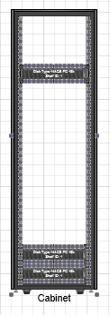

## **Get the Connectors Glued to a Particular Shape**
[Add and Connect Visio Shapes](https://docs.aspose.com/diagram/net/add-retrieve-copy-and-read-visio-shape-data/) explains how to add a shape and connect it to other shapes in Microsoft Visio diagrams using Aspose.Diagram for .NET. It is also possible to find connectors that are glued to this shape.
### **Getting Glued Shapes**
The GluedShapes method exposed by the [Shape](http://www.aspose.com/api/net/diagram/aspose.diagram/shape) class can be used to get a list of the IDs of all the connectors glued to a shape, or, if the shape in question is a connector, the IDs of the shapes it's connected to.The GetShape method, exposed by the [ShapeCollection](http://www.aspose.com/api/net/diagram/aspose.diagram/shapecollection) class, can then be used to find a shape by its ID.

The code below shows how to:

1. Load a sample file.
1. Access a particular shape.
1. Get a list of IDs of all the connectors glued to this shape.
#### **Get Connectors Glued Programming Sample**
Use the following code in your .NET application to find all the connectors glued to a shape using Aspose.Diagram for .NET.


## **Glue Visio Shapes Together with Connection Point**
Aspose.Diagram for .NET allows developers glue shapes together through the connection points.
### **Glue Shapes**
The GlueShapes method exposed by the [Page](http://www.aspose.com/api/net/diagram/aspose.diagram/page) class can be used.

|
**Input diagram** 

|
**The diagram after gluing the shapes** 

|
| :- | :- |
The code below shows how to:

1. Load a sample file.
1. Glue shapes.
1. Save diagram.
#### **Glue Visio Shapes Programming Sample**
Use the following code in your .NET application to glue shapes through the connection points:


## **Glue Shapes Inside the Container**
Aspose.Diagram for .NET enables developers to glue group shapes inside a container.
### **Glue Group Shape**
The GlueShapesInContainer method exposed by the [Page](http://www.aspose.com/api/net/diagram/aspose.diagram/page) class can be used.

|
**Input diagram** 

|
**The diagram after gluing the group shapes** 

|
| :- | :- |
The code below shows how to:

1. Load a sample file.
1. Glue group shapes.
1. Save diagram.
#### **Glue Shapes Inside Programming Sample**
Use the following code in your .NET application to glue group shape inside a container:


