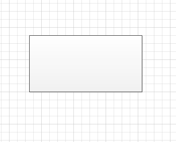
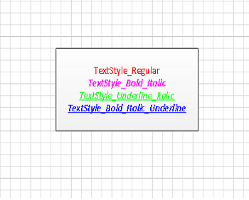
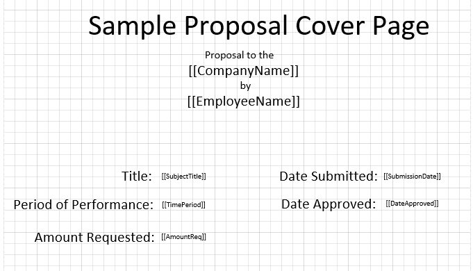

## **Insert a Text Shape in the Visio Page**
Aspose.Diagram API lets developers to insert a text shape anywhere in the Visio page. To achieve this, the AddText method of the [Page](http://www.aspose.com/api/net/diagram/aspose.diagram/page) class takes PinX, PinY, width, height and text parameters.
### **Insert a Text Shape Programming Sample**
The following piece of code adds a text shape in the Visio diagram.


// For complete examples and data files, please go to https://github.com/aspose-diagram/Aspose.Diagram-for-.NET
// The path to the documents directory.
string dataDir = RunExamples.GetDataDir_ShapeText();

// Create a new diagram
Diagram diagram = new Diagram();
// Set parameters and add text to a Visio page
double PinX = 1, PinY = 1, Width = 1, Height = 1;                  
diagram.Pages[0].AddText(PinX, PinY, Width, Height, "Test text");
// Save diagram 
diagram.Save(dataDir + "InsertTextShape_out.vsdx", SaveFileFormat.VSDX);



## **Update Visio Shape Text**
As well as [creating diagrams](/diagram/net/load-or-create-a-visio-drawing/), Aspose.Diagram for .NET lets you work with shapes in different ways. This article looks at how to access and update text in shapes. The Text property, exposed by the [Shape](http://www.aspose.com/api/net/diagram/aspose.diagram/shape) class, supports the Aspose.Diagram.Text object. The property can be used to retrieve or update a shape's text. The process for updating a shape's text is straightforward:

1. Load a diagram.
1. Find a particular shape.
1. Set the new text.
1. Save the diagram.
### **Update Shape Text Programming Sample**
The following piece of code updates a shape's text. Shapes are identified by their IDs. The code segments below look for a shape called process and with the ID 1 and changes its text.


// For complete examples and data files, please go to https://github.com/aspose-diagram/Aspose.Diagram-for-.NET
// The path to the documents directory.
string dataDir = RunExamples.GetDataDir_ShapeText();

// Call the diagram constructor to load diagram from a VDX file
Diagram diagram = new Diagram(dataDir + "UpdateShapeText.vsd");
// Get page by name
Page page = diagram.Pages.GetPage("Flow 1");
// Find a particular shape and update its text
foreach (Aspose.Diagram.Shape shape in page.Shapes)
{
    if (shape.NameU.ToLower() == "process" && shape.ID == 1)
    {
        shape.Text.Value.Clear();
        shape.Text.Value.Add(new Txt("New Text"));
    }
}
// Save diagram
diagram.Save(dataDir + "UpdateShapeText_out.vdx", SaveFileFormat.VDX);



## **Apply Built-in or Custom Stylesheet to a Visio Shape**
Microsoft Visio style sheets store formatting information that can be applied to shapes for a consistent look and feel. Aspose.Diagram for .NET allows you to apply style sheets from inside an application.

The TextStyle, FillStyle and LineStyle properties exposed by the [Shape](http://www.aspose.com/api/net/diagram/aspose.diagram/shape) class support the [Aspose.Diagram.StyleSheet](http://www.aspose.com/api/net/diagram/aspose.diagram/stylesheet) object. The property can be used to retrieve style information and apply custom text, line and fill styles to a diagram.
### **Custom Styles in Microsoft Visio**
To apply custom styles to shapes in Microsoft Visio:

1. Open a diagram in Microsoft Visio.
1. Select **Define Styles** from the **Format** menu (Visio 2007), or right-click **Styles** in the **Drawing Explorer** window, and select **Define Styles** (Visio 2010).
1. In the **Define Styles** dialog, type a new name for your custom style sheet. For example, CustomStyle1.
1. Click the **Text**, **Line** and **Fill** buttons to set text, line and fill styles respectively.
1. Click **OK**.

After defining custom style sheets in Microsoft Visio, use the following code in a .NET application to apply custom styles to your shapes. Note that the code samples below call the custom style sheet defined above: you need to know the name and location of the sheet you apply. To apply custom styles programmatically:

1. Load a diagram.
1. Find the shape you want to apply a style to.
1. Load the stylesheet.
1. Apply styles.
1. Save the diagram.
#### **Apply Custom Styles Programming Sample**


// For complete examples and data files, please go to https://github.com/aspose-diagram/Aspose.Diagram-for-.NET
// The path to the documents directory.
string dataDir = RunExamples.GetDataDir_ShapeText();

// Load diagram
Diagram vsdDiagram = new Diagram(dataDir + "ApplyCustomStyleSheets.vsd");
// Get page by name
Page page = vsdDiagram.Pages.GetPage("Flow 1");

Shape sourceShape = null;
// Find the shape to apply the style
foreach (Aspose.Diagram.Shape shape in page.Shapes)
{
    if (shape.Name == "Process")
    {
        sourceShape = shape;
        break;
    }
}

StyleSheet customStyleSheet = null;

// Find the required style sheet
foreach (StyleSheet styleSheet in vsdDiagram.StyleSheets)
{
    if (styleSheet.Name == "Basic")
    {
        customStyleSheet = styleSheet;
        break;
    }
}

if (sourceShape != null && customStyleSheet != null)
{
    // Apply text style
    sourceShape.TextStyle = customStyleSheet;
    // Apply fill style
    sourceShape.FillStyle = customStyleSheet;
    // Apply line style
    sourceShape.LineStyle = customStyleSheet;
}

// Save changed diagram as VDX
vsdDiagram.Save(dataDir + "ApplyCustomStyleSheets_out.vdx", SaveFileFormat.VDX);



## **Apply Different Style on the Each Text Value of a Shape**
As well as [creating diagrams](/diagram/net/load-or-create-a-visio-drawing/), Aspose.Diagram for .NET lets you work with shapes in different ways. This article helps to add multiple text values to a shape and apply different style on each text value.

{} 

The Shape element contains an element called Text, which contains the characters of the text and special elements (cp, pp, tp, and fld) that mark the end of one run and the beginning of the next. Char Element contains the formatting attributes for the shape's text, such as font, color, text style, case, position relative to the baseline, and point size.

{} 
### **Adding Shape Text and Styles**

|**Input diagram**|
| :- |
||

|**Diagram after adding various text values to a shape with different style on each text value**|
| :- |
||
#### **Adding Text and Styles Programming Sample**
The following piece of code add a shape's text and different styles.


// For complete examples and data files, please go to https://github.com/aspose-diagram/Aspose.Diagram-for-.NET
// The path to the documents directory.
string dataDir = RunExamples.GetDataDir_ShapeText();

// Load diagram
Diagram diagram = new Diagram(dataDir + "Drawing1.vsdx");
// Get page by name
Page page = diagram.Pages.GetPage("Page-1");
// Get shape by ID
Shape shape = page.Shapes.GetShape(1);
// Clear shape text values and chars
shape.Text.Value.Clear();
shape.Chars.Clear();

// Mark character run and add text
shape.Text.Value.Add(new Cp(0));
shape.Text.Value.Add(new Txt("TextStyle_Regular\n"));
shape.Text.Value.Add(new Cp(1));
shape.Text.Value.Add(new Txt("TextStyle_Bold_Italic\n"));
shape.Text.Value.Add(new Cp(2));
shape.Text.Value.Add(new Txt("TextStyle_Underline_Italic\n"));
shape.Text.Value.Add(new Cp(3));
shape.Text.Value.Add(new Txt("TextStyle_Bold_Italic_Underline"));

// Add formatting characters
shape.Chars.Add(new Aspose.Diagram.Char());
shape.Chars.Add(new Aspose.Diagram.Char());
shape.Chars.Add(new Aspose.Diagram.Char());
shape.Chars.Add(new Aspose.Diagram.Char());

// Set properties e.g. color, font, size and style etc.
shape.Chars[0].IX = 0;
shape.Chars[0].Color.Value = "#FF0000";
shape.Chars[0].Font.Value = 4;
shape.Chars[0].Size.Value = 0.22;
shape.Chars[0].Style.Value = StyleValue.Undefined;

// Set properties e.g. color, font, size and style etc.
shape.Chars[1].IX = 1;
shape.Chars[1].Color.Value = "#FF00FF";
shape.Chars[1].Font.Value = 4;
shape.Chars[1].Size.Value = 0.22;
shape.Chars[1].Style.Value = StyleValue.Bold | StyleValue.Italic;

// Set properties e.g. color, font, size and style etc.
shape.Chars[2].IX = 2;
shape.Chars[2].Color.Value = "#00FF00";
shape.Chars[2].Font.Value = 4;
shape.Chars[2].Size.Value = 0.22;
shape.Chars[2].Style.Value = StyleValue.Underline | StyleValue.Italic;

// Set properties e.g. color, font, size and style etc.
shape.Chars[3].IX = 3;
shape.Chars[3].Color.Value = "#3333FF";
shape.Chars[3].Font.Value = 4;
shape.Chars[3].Size.Value = 0.22;
shape.Chars[3].Style.Value = StyleValue.Bold | StyleValue.Italic | StyleValue.Underline;
// Save diagram
diagram.Save(dataDir + "ApplyFontOnText_out.vsdx", SaveFileFormat.VSDX);



## **Find and Replace the Text of a Shape**
The [Txt](http://www.aspose.com/api/net/diagram/aspose.diagram/txt) Class allows you to edit the shape's text. The Replace method, exposed by the [Txt](http://www.aspose.com/api/net/diagram/aspose.diagram/txt) class, support changing the text of a shape.
The code examples in this article find and replace the shape's text on the page.

|**Input diagram**|
| :- |
||

|**The diagram after the shape is edited**|
| :- |
||
The process for changing the shape's text:

1. Load a diagram.
1. Find a particular text of a shape.
1. Replace text of this shape
1. Save the diagram.
### **Find and Replace Text Programming Sample**
The code snippets below show how to modify the shape's text. The code iterate through the shapes of a page.


// For complete examples and data files, please go to https://github.com/aspose-diagram/Aspose.Diagram-for-.NET
// The path to the documents directory.
string dataDir = RunExamples.GetDataDir_ShapeText();

// Prepare a collection old and new text
Dictionary<string, string> replacements = new Dictionary<string, string>();
replacements.Add("[[CompanyName]]", "Research Society of XYZ");
replacements.Add("[[EmployeeName]]", "James Bond");
replacements.Add("[[SubjectTitle]]", "The affect of the internet on social behavior in the industrialize world");
replacements.Add("[[TimePeriod]]", DateTime.Now.AddYears(-1).ToString("dd/MMMM/yyyy") + " -- " + DateTime.Now.ToString("dd/MMMM/yyyy"));
replacements.Add("[[SubmissionDate]]", DateTime.Now.AddDays(-7).ToString("dd/MMMM/yyyy"));
replacements.Add("[[AmountReq]]", "$100,000");
replacements.Add("[[DateApproved]]", DateTime.Now.AddDays(1).ToString("dd/MMMM/yyyy"));

// Load diagram
Diagram diagram = new Diagram(dataDir + "FindReplaceText.vsdx");
// Get page by name
Page page = diagram.Pages.GetPage("Page-1");

// Iterate through the shapes of a page
foreach (Shape shape in page.Shapes)
{
    foreach (KeyValuePair<string, string> kvp in replacements)
    {
        foreach (FormatTxt txt in shape.Text.Value)
        {
            Txt tx = txt as Txt;
            if (tx != null && tx.Text.Contains(kvp.Key))
            {
                // Find and replace text of a shape
                tx.Text = tx.Text.Replace(kvp.Key, kvp.Value);
            }
        }
    }
}
// Save the diagram
diagram.Save(dataDir + "FindAndReplaceShapeText_out.vsdx", SaveFileFormat.VSDX);



## **Extract Plain Text from the Visio Diagram Page**
Aspose.Diagram API allows developers to extract plain text from the Visio diagram page. They can also iterate through the Visio diagram pages to cover the whole Visio diagram text.

Microsoft Office Visio adds the text to the shapes. The [Shape](http://www.aspose.com/api/net/diagram/aspose.diagram/shape) class contains an element called Text, which contains the characters of the text and special elements (cp, pp, tp, and fld) that mark the end of one run and the beginning of the next.
### **Extract Plain Text Programming Sample**
The following piece of code iterates through the shapes of the Visio Page and filter plain text without formatting information.


// For complete examples and data files, please go to https://github.com/aspose-diagram/Aspose.Diagram-for-.NET
static string text = "";
public static void Run()
{
    // The path to the documents directory.
    string dataDir = RunExamples.GetDataDir_ShapeText();
    // Load diagram
    Diagram diagram = new Diagram(dataDir + "Drawing1.vsdx");

    // Get Visio diagram page
    Aspose.Diagram.Page page = diagram.Pages.GetPage("Page-1");

    // Iterate through the shapes
    foreach (Aspose.Diagram.Shape shape in page.Shapes)
    {
        // Extract plain text from the shape
        GetShapeText(shape);
    }
    // Display extracted text
    Console.WriteLine(text);
}
private static void GetShapeText(Aspose.Diagram.Shape shape)
{
    // Filter shape text
    if (shape.Text.Value.Text != "")
        text += Regex.Replace(shape.Text.Value.Text, "\\<.*?>", "");

    // For image shapes
    if (shape.Type == TypeValue.Foreign)
        text += (shape.Name);

    // For group shapes
    if (shape.Type == TypeValue.Group)
        foreach (Aspose.Diagram.Shape subshape in shape.Shapes)
        {
            GetShapeText(subshape);
        }
}



