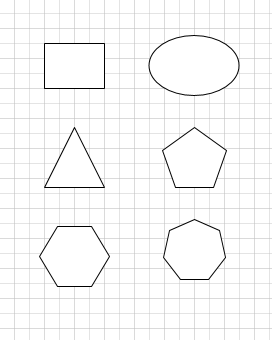
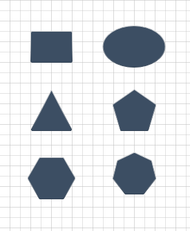
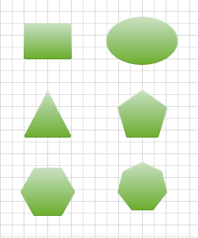
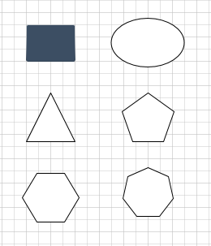
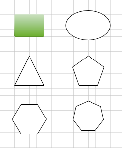
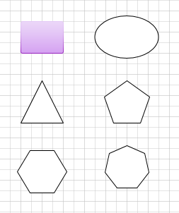

## **How to Apply a Preset theme to a Page or a Shape**
This article can be useful to anyone who wants to modify the theme of a giving VSDX file using Aspose.Diagram. We use a test file Themes1.vsdx, look like below.

|**Theme1.vsdx**|
| :- |
||

### **Apply a Preset Theme to a Page**
Aspose.Diagram APIs allows to apply a preset theme to get a uniform look and feel to shapes within a page, and across multiple documents. Perform the following steps in order to do this:

- Create an instance of Diagram class to load a diagram
- Get an instance of Page class to be set theme
- Assign a Preset value to the PresetTheme property of the Page instance
#### **Apply a Preset Theme to a Page Programming Sample**


// For complete examples and data files, please go to https://github.com/aspose-diagram/Aspose.Diagram-for-.NET
// The path to the documents directory.
string dataDir = RunExamples.GetDataDir_VisioThemes();
// Load diagram
Diagram diagram = new Diagram(dataDir + "Themes1.vsdx");
//Get an instance of Page class to be set theme
Page page = diagram.Pages[0];
//Assign a Preset value to the PresetTheme property of the Page instance
page.PresetTheme = PresetThemeValue.Bubble;
// Save diagram
diagram.Save(dataDir + "SetTheme_out.vsdx", SaveFileFormat.VSDX);



|**Result of Apply a Preset Theme to a Page**|
| :- |
||

### **Apply a Preset Theme Variant to a Page**

Aspose.Diagram APIs allows to apply a preset theme variant to get a uniform look and feel to shapes within a page, and across multiple documents. Perform the following steps in order to do this:

- Create an instance of Diagram class to load a diagram
- Get an instance of Page class to be set theme
- Assign a Preset value to the PresetTheme property of the Page instance
- Assign a Preset value to the PresetThemeVariant property of the Page instance

#### **Apply a Preset Theme Variant to a Page Programming Sample**


// For complete examples and data files, please go to https://github.com/aspose-diagram/Aspose.Diagram-for-.NET
// The path to the documents directory.
string dataDir = RunExamples.GetDataDir_VisioThemes();
// Load diagram
Diagram diagram = new Diagram(dataDir + "Themes1.vsdx");
//Get an instance of Page class to be set theme
Page page = diagram.Pages[0];
//Assign a Preset value to the PresetTheme property of the Page instance
page.PresetTheme = PresetThemeValue.Bubble;
//Assign a Preset value to the PresetThemeVariant property of the Page instance
page.PresetThemeVariant = PresetThemeVariantValue.Variant3;
// Save diagram
diagram.Save(dataDir + "SetTheme_out.vsdx", SaveFileFormat.VSDX);


|**Result of Apply a Preset Theme Variant to a Page**|
| :- |
||

### **Apply a Preset Theme to a Shape**

Aspose.Diagram APIs allows to apply a preset theme to a shape within a page. Perform the following steps in order to do this:

- Create an instance of Diagram class to load a diagram
- Get an instance of Shape class to be set theme
- Assign a Preset value to the PresetTheme property of the Shape instance

#### **Apply a Preset Theme to a Shape Programming Sample**


// For complete examples and data files, please go to https://github.com/aspose-diagram/Aspose.Diagram-for-.NET
// The path to the documents directory.
string dataDir = RunExamples.GetDataDir_VisioThemes();
// Load diagram
Diagram diagram = new Diagram(dataDir + "Themes1.vsdx");
//Get an instance of Shape class to be set theme
Shape shape = doc.Pages[0].Shapes[0];
//Assign a Preset value to the PresetTheme property of the Shape instance
shape.PresetTheme = PresetThemeValue.Bubble;
// Save diagram
diagram.Save(dataDir + "SetTheme_out.vsdx", SaveFileFormat.VSDX);


|**Result of Apply a Preset Theme to a Shape**|
| :- |
||

### **Apply a Preset Theme Variant to a Shape**

Aspose.Diagram APIs allows to apply a preset theme variant to a shape within a page. Perform the following steps in order to do this:

- Create an instance of Diagram class to load a diagram
- Get an instance of Shape class to be set theme
- Assign a Preset value to the PresetTheme property of the Shape instance
- Assign a Preset value to the PresetThemeVariant property of the Shape instance

#### **Apply a Preset Theme Variant to a Shape Programming Sample**


// For complete examples and data files, please go to https://github.com/aspose-diagram/Aspose.Diagram-for-.NET
// The path to the documents directory.
string dataDir = RunExamples.GetDataDir_VisioThemes();
// Load diagram
Diagram diagram = new Diagram(dataDir + "Themes1.vsdx");
//Get an instance of Shape class to be set theme
Shape shape = doc.Pages[0].Shapes[0];
//Assign a Preset value to the PresetTheme property of the Shape instance
shape.PresetTheme = PresetThemeValue.Bubble;
//Assign a Preset value to the PresetThemeVariant property of the Shape instance
shape.PresetThemeVariant = PresetThemeVariantValue.Variant3;
// Save diagram
diagram.Save(dataDir + "SetTheme_out.vsdx", SaveFileFormat.VSDX);


|**Result of Apply a Preset Theme Variant to a Shape**|
| :- |
||

### **Apply a Preset Theme Variant Quickstyle to a Shape**

Aspose.Diagram APIs allows to apply a preset theme quickstyle to a shape within a page. Perform the following steps in order to do this:

- Create an instance of Diagram class to load a diagram
- Get an instance of Shape class to be set theme
- Assign a Preset value to the PresetTheme property of the Shape instance
- Assign a Preset value to the PresetThemeVariant property of the Shape instance
- Assign a Preset value to the PresetThemeQuickStyle property of the Shape instance

#### **Apply a Preset Theme Variant Quickstyle to a Shape Programming Sample**


// For complete examples and data files, please go to https://github.com/aspose-diagram/Aspose.Diagram-for-.NET
// The path to the documents directory.
string dataDir = RunExamples.GetDataDir_VisioThemes();
// Load diagram
Diagram diagram = new Diagram(dataDir + "Themes1.vsdx");
//Get an instance of Shape class to be set theme
Shape shape = doc.Pages[0].Shapes[0];
//Assign a Preset value to the PresetTheme property of the Shape instance
shape.PresetTheme = PresetThemeValue.Bubble;
//Assign a Preset value to the PresetThemeVariant property of the Shape instance
shape.PresetThemeVariant = PresetThemeVariantValue.Variant3;
//Assign a Preset value to the PresetThemeQuickStyle property of the Shape instance
shape.PresetThemeQuickStyle = PresetQuickStyleValue.VariantStyle2;
// Save diagram
diagram.Save(dataDir + "SetTheme_out.vsdx", SaveFileFormat.VSDX);


|**Result of Apply a Preset Theme Variant Quickstyle to a Shape**|
| :- |
||

### **Apply a Preset Theme Style to a Shape Using SetPresetThemeStyleMatrics Method**

Aspose.Diagram APIs allows to apply a preset theme quickstyle to a shape within a page. Perform the following steps in order to do this:

- Create an instance of Diagram class to load a diagram
- Get an instance of Shape class to be set theme
- Assign a Preset value to the PresetTheme property of the Shape instance
- Assign a Preset value to the PresetThemeVariant property of the Shape instance
- Assign a theme style by setting style value and color value of the Shape instance using SetPresetThemeStyleMatrics Method

#### **Apply a Preset Theme Style to a Shape Using SetPresetThemeStyleMatrics Method Programming Sample**


// For complete examples and data files, please go to https://github.com/aspose-diagram/Aspose.Diagram-for-.NET
// The path to the documents directory.
string dataDir = RunExamples.GetDataDir_VisioThemes();
// Load diagram
Diagram diagram = new Diagram(dataDir + "Themes1.vsdx");
//Get an instance of Shape class to be set theme
Shape shape = doc.Pages[0].Shapes[0];
//Assign a Preset value to the PresetTheme property of the Shape instance
shape.PresetTheme = PresetThemeValue.Bubble;
//Assign a Preset value to the PresetThemeVariant property of the Shape instance
shape.PresetThemeVariant = PresetThemeVariantValue.Variant3;
//Assign a theme style by setting style value and color value of the Shape instance
shape.SetPresetThemeStyleMatrics(PresetStyleMatricsValue.Style2, PresetColorMatricsValue.Color7);
// Save diagram
diagram.Save(dataDir + "SetTheme_out.vsdx", SaveFileFormat.VSDX);


|**Result of Apply a Preset Theme Style to a Shape Using SetPresetThemeStyleMatrics Method**|
| :- |
||
