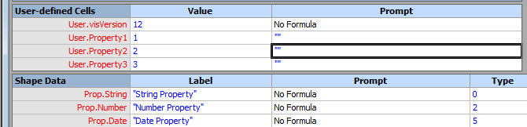
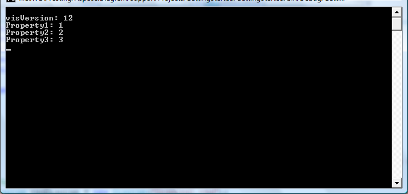

## **Read User-defined Cells of the Visio Shapes**
Users insert text fields into shapes to display additional information. **User-defined Cells** is the one branch of these fields and this branch uses information entered in the Value cell of the User-defined Cells section in the shape's ShapeSheet. Developers can insert and read all user defined cells using [Aspose.Diagram for .NET API](https://products.aspose.com/diagram/net/).
### **Retrieve the User-defined Cells Fields**
Users collection exposed by [Shape](http://www.aspose.com/api/net/diagram/aspose.diagram/shape) class supports the Aspose.Diagram.User object. This property can be used to read the user defined cells of a Visio shape as available in the User-defined Cells section of the shape's ShapeSheet.


#### **Retrieve Cells Programming Sample**
The following piece of code allows developers to read the user defined cells fields.

```

// For complete examples and data files, please go to https://github.com/aspose-diagram/Aspose.Diagram-for-.NET
// The path to the documents directory.
string dataDir = RunExamples.GetDataDir_UserDefinedCells();

// Load source Visio diagram
Diagram diagram = new Diagram(dataDir + "Drawing1.vsdx");
// Get page by name
Page page = diagram.Pages.GetPage("Page-1");
// Get shape by id
Shape shape = page.Shapes.GetShape(1);
// Extract user defined cells of the shape
foreach (User user in shape.Users)
{
    Console.WriteLine(user.Name + ": " + user.Value.Val);
}


```


This image shows the output after running the above code:


## **Create User-defined Cell in the ShapeSheet**
[Aspose.Diagram for .NET API](https://products.aspose.com/diagram/net/) allows to create user-defined cell in the shapesheet. This example topic describes the way, developers can add as many User.name rows as they need, assign meaningful names to the rows, and set cell values.
### **Create User-defined Cell**
The Add method exposed by the Users Collection can be used to create a user-defined cell in the shapesheet. It takes a single parameter.
#### **Create Cell Programming Sample**
Use the following code example in your .NET application to create user-defined cell in the shapesheet using Aspose.Diagram for .NET.

```

// For complete examples and data files, please go to https://github.com/aspose-diagram/Aspose.Diagram-for-.NET
// The path to the documents directory.
string dataDir = RunExamples.GetDataDir_UserDefinedCells();

// Load source Visio diagram
Diagram diagram = new Diagram(dataDir + "Drawing1.vsdx");
// Get page by name
Page page = diagram.Pages.GetPage("Page-1");
// Get shape by id
Shape shape = page.Shapes.GetShape(2);
            
// Initialize user object
User user = new User();
user.Name = "UserDefineCell";
user.Value.Val = "800";
// Add user-defined cell
shape.Users.Add(user);

// Save diagram
diagram.Save(dataDir + "CreateUserDefinedCellInShapeSheet_out.vsdx", SaveFileFormat.VSDX);


```
## **Retrieve User-defined Cells from Shapesheet**
Aspose.Diagram for .NET API allows to retrieve user-defined cells from shapesheet. This example topic describes the way, developers can retrieve all User.name for all shapes in a drawing.
### **Retrieve User-defined Cells**
The NameU, Value.Val and Prompt.Value properties exposed by the User class can be used to retrieve user-defined cells from shapesheet.
#### **Retrieve Cells from Shapesheet Programming Samples**
Use the following code in your .NET application to retrieve all user-defined cells from shapesheet using Aspose.Diagram for .NET.

```

// For complete examples and data files, please go to https://github.com/aspose-diagram/Aspose.Diagram-for-.NET
// The path to the documents directory.
string dataDir = RunExamples.GetDataDir_UserDefinedCells();
int count = 0;
// Load diagram
Diagram diagram = new Diagram(dataDir + "Drawing1.vsdx");

// Iterate through pages
foreach (Aspose.Diagram.Page objPage in diagram.Pages)
{
    // Iterate through shapes
    foreach (Aspose.Diagram.Shape objShape in objPage.Shapes)
    {
        Console.WriteLine(objShape.NameU);
        // Iterate through user-defined cells
        foreach (Aspose.Diagram.User objUserField in objShape.Users)
        {
            count++;
            Console.WriteLine(count + " - Name: " + objUserField.NameU + " Value: " + objUserField.Value.Val + " Prompt: " + objUserField.Prompt.Value);
        }
    }
}  


```
