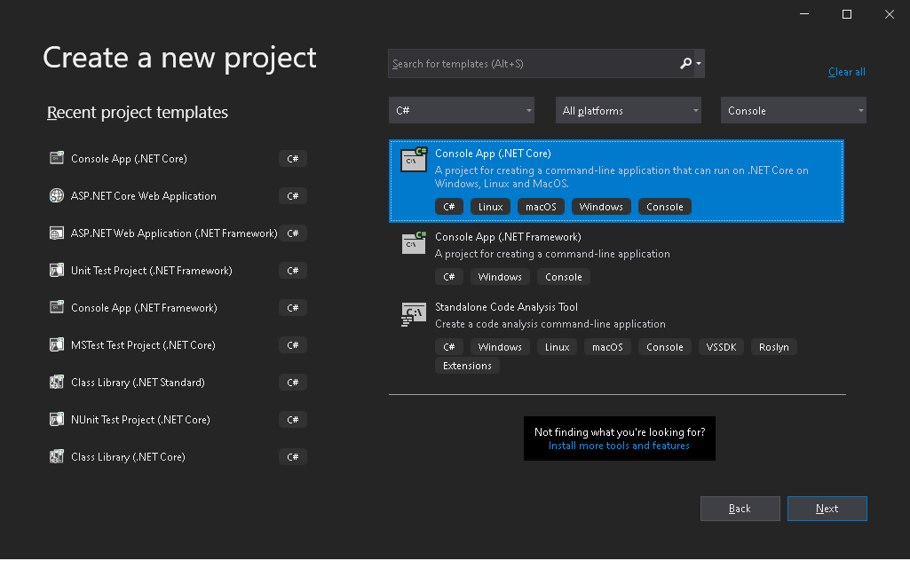
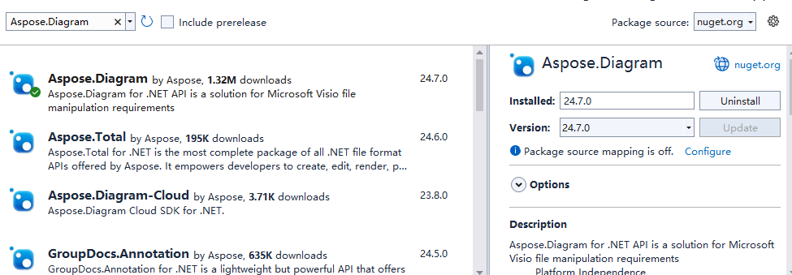

Microservices, in conjunction with containerization make it possible to easily combine technologies. Docker allows you to easily integrate Aspose.Diagram functionality into your application, regardless of what technology is in your development stack.

In case you are targeting microservices, or if the main technology in your stack is not .NET, C++ or Java, but you need Aspose.Diagram functionality, or if you already use Docker in your stack, then you may be interested in utilizing Aspose.Diagram in a Docker container.

## Prerequisites

- Docker must be installed on your system. For information on how to install Docker on Windows or Mac, refer to the links in the "See Also" section.

- Also, note that Visual Studio 2019, .NET Core 3.1 SDK is used in the example, provided below.

## Hello World Application

In this example, you create a simple Hello World console application that makes a “Hello World!” document and saves it in all supported save formats. The application can then be built and run in Docker.

### Creating the Console Application

To create the Hello World program, follow the steps below:
1. Once Docker is installed, make sure that it uses Linux Containers (default). If necessary, select the Switch to Linux containers option from the Docker Desktops menu.
1. In Visual Studio, create a .NET Core console application. 
 
1. Install the latest Aspose.Diagram version from NuGet. System.Drawing.Common and System.Text.Encoding.CodePages will be installed as a dependency of Aspose.Diagram. 
 
1. Since the application will be run on Linux, the appropriate native Linux assets must be installed. Start with the dotnet core sdk 3.1 base image and install libgdiplus libc6-dev.
1. When all required dependencies are added, write a simple program that creates a “Hello World!” diagram and saves it in all supported save formats: 
**.NET** 

using System;
namespace Aspose.Diagram.Docker
{
    class Program
    {
        static void Main(string[] args)
        {
            Aspose.Diagram.Diagram diagram = new Aspose.Diagram.Diagram();
            diagram.Pages[0].PageSheet.PageProps.PageWidth.Value = 10;
            diagram.Pages[0].PageSheet.PageProps.PageHeight.Value = 10;
            var shapeId = diagram.Pages[0].DrawRectangle(5, 5, 5, 3);
            Shape shape = diagram.Pages[0].Shapes.GetShape(shapeId);
            shape.Line.LineWeight.Value = 0.1;
            shape.Line.Rounding.Value = 0;
            // add text to shape
            var txt = new Txt("Hello world!");
            shape.Text.Value.Add(txt);
            Aspose.Diagram.Char ch = new Aspose.Diagram.Char();
            shape.Chars.Add(ch);
            ch.IX = 0;
            // set text font
            ch.FontName.Value = "Courier New";
            // set text color
            ch.Color.Value = "#ff0000";
            // set font size
            ch.Size.Value = 24 / 72.0;							
					
            Aspose.Diagram.Para para = new Para();
            shape.Paras.Add(para);
            para.IX = 0;
            // set horizon align
            para.HorzAlign.Value = HorzAlignValue.LeftAlign;
            // set indent
            para.IndLeft.Value = 0.3;
					
            shape.TextBlock.TextDirection.Value = TextDirectionValue.Vertical;
            shape.TextBlock.VerticalAlign.Value = VerticalAlignValue.Middle;
					
            diagram.Save("//TestOut//output.vsdx", SaveFileFormat.Vsdx);
        }
    }
}



Note that the “TestOut” folder is specified as an output folder for saving output documents. When running the application in Docker, a folder on the host machine will be mounted to this folder in the container. This will enable you to easily view the output generated by Aspose.Diagram in the Docker container.

### Configuring a Dockerfile

The next step is to create and configure the Dockerfile.

1. Create the Dockerfile and place it next to the solution file of your application. Keep this file name without extension (the default).
1. In the Dockerfile, specify:


FROM mcr.microsoft.com/dotnet/core/sdk:3.1-buster 
COPY fonts/* /usr/share/fonts/
WORKDIR /app
COPY . ./
RUN apt-get update && \
    apt-get install -y --allow-unauthenticated libgdiplus libc6-dev
RUN dotnet publish "Aspose.Diagram.Docker.csproj" -c Release -o /app/publish
ENTRYPOINT ["dotnet", "publish/Aspose.Diagram.Docker.dll"]


The above is a simple Dockerfile, which contains the following instructions:

- The SDK image to be used. Here it is the .Net Core SDK 3.1 image. Docker will download it when the build is run. The version of SDK is specified as a tag.
- Install Fonts because the SDK image contains very few fonts. The command copies font files from local to docker image. Make sure you have a local "fonts" directory that contains all the fonts you need to install. In this example, the local "fonts" directory is put in the same directory as the Dockerfile.
- The working directory, which is specified in the next line.
- The command to copy everything to container, publish the application, and specify the entry point.
- The command to install libgdiplus is run in the container. This is required by System.Drawing.Common.

### Building and Running the Application in Docker

Now the application can be built and run in Docker. Open your favorite command prompt, change directory to the folder with the application (folder where the solution file and the Dockerfile are placed) and run the following command:


docker build -t actest .


The first time this command is executed it may take longer, since Docker needs to download the required images. Once the previous command is completed, run the following command:


docker run --mount type=bind,source=C:\Temp,target=/TestOut --rm actest from Docker


{} 

Pay attention to the mount argument, because, as mentioned earlier, a folder on the host machine is mounted into the container’s folder, to easily see the results of the application execution. Paths in Linux are case sensitive.

{}

## Images Supporting Aspose.Diagram

- Aspose.Diagram for .NET Standard not support EMF and TIFF on Linux.

## More Examples

***1. To run the application in Windows Server 2019***

- Dockerfile


FROM microsoft/dotnet-framework:4.7.2-sdk-windowsservercore-ltsc2019
WORKDIR /app
COPY . ./
RUN dotnet publish "Aspose.Diagram.Docker.csproj" -c Release -o /app/publish
ENTRYPOINT ["dotnet", "publish/Aspose.Diagram.Docker.dll"]


- Build Docker Image


docker build -t actest .


- Run Docker Image


docker run --mount type=bind,source=C:\Temp,target=c:\TestOut --rm actest from Docker


***2. To run the application  in Linux***

- Write a simple program that set font folder , creates a “Hello World!” diagram and saves it.


namespace Aspose.Diagram.Docker.Fonts
{
    using System;
    using System.IO;

    class Program
    {
        static void Main(string[] args)
        {
            try
            {
               Aspose.Diagram.Diagram diagram = new Aspose.Diagram.Diagram();
               diagram.Pages[0].PageSheet.PageProps.PageWidth.Value = 10;
               diagram.Pages[0].PageSheet.PageProps.PageHeight.Value = 10;
               var shapeId = diagram.Pages[0].DrawRectangle(5, 5, 5, 3);
               Shape shape = diagram.Pages[0].Shapes.GetShape(shapeId);
               shape.Line.LineWeight.Value = 0.1;
               shape.Line.Rounding.Value = 0;
               // add text to shape
               var txt = new Txt("Hello world!");
               shape.Text.Value.Add(txt);
               Aspose.Diagram.Char ch = new Aspose.Diagram.Char();
               shape.Chars.Add(ch);
               ch.IX = 0;
               // set text font
               ch.FontName.Value = "Courier New";
               // set text color
               ch.Color.Value = "#ff0000";
               // set font size
               ch.Size.Value = 24 / 72.0;							
					
               Aspose.Diagram.Para para = new Para();
               shape.Paras.Add(para);
               para.IX = 0;
               // set horizon align
               para.HorzAlign.Value = HorzAlignValue.LeftAlign;
               // set indent
               para.IndLeft.Value = 0.3;
					
               shape.TextBlock.TextDirection.Value = TextDirectionValue.Vertical;
               shape.TextBlock.VerticalAlign.Value = VerticalAlignValue.Middle;
					
               diagram.Save("//TestOut//output.vsdx", SaveFileFormat.Vsdx);
            }
            catch (Exception e)
            {
                
            }
           
        }
    }
}


- Dockerfile


FROM mcr.microsoft.com/dotnet/core/sdk:3.1-buster 
WORKDIR /app
COPY . ./
RUN apt-get update && \
    apt-get install -y --allow-unauthenticated libgdiplus libc6-dev
WORKDIR /app
COPY . ./
RUN dotnet publish "Aspose.Diagram.Docker.Fonts.csproj" -c Release -o /app/publish
ENTRYPOINT ["dotnet", "publish/Aspose.Diagram.Docker.Fonts.dll"]


- Build Docker Image


docker build -t actest .


- Run Docker Image


docker run --mount type=bind,source=C:\Windows\Fonts,target=/Fonts  --mount type=bind,source=C:\Temp,target=/TestOut --rm actest from Docker


## See Also

- [Install Docker Desktop on Windows](https://docs.docker.com/docker-for-windows/install/)
- [Install Docker Desktop on Mac](https://docs.docker.com/docker-for-mac/install/)
- [Visual Studio 2019, .NET Core 3.1 SDK](https://docs.microsoft.com/en-us/dotnet/core/install/windows?tabs=netcore31#dependencies)
- [Switch to Linux containers](https://docs.docker.com/docker-for-windows/#switch-between-windows-and-linux-containers) option
- Additional information on [.NET Core SDK](https://hub.docker.com/_/microsoft-dotnet-sdk)
