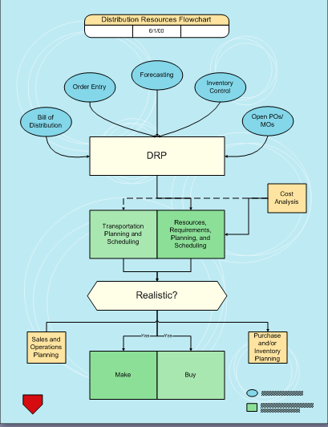

## **Export Visio to HTML**
This article explains how to export a Microsoft Visio diagram to HTML using [Aspose.Diagram for Python via .NET](https://products.aspose.com/diagram/python-net/) API.

Use the Diagram class constructor to read the diagram files and the Save method to export the diagram to any supported image format. Developers can save resultant HTML in the local storage or directly to a stream instance.

1. [Save resultant HTML in the local storage](https://docs.aspose.com/diagram/net/convert-visio-to-html/#save-resultant-html-in-the-local-storage).
1. [Save resultant HTML in a stream instance](https://docs.aspose.com/diagram/net/convert-visio-to-html/#save-resultant-html-in-a-stream-instance).

The image below shows a VSD file about to be saved to PNG format. You can use other diagram formats (VSDX, VSDM, VSTX, VSSX, VSS, VSSM, VDX, VST, VSTX, VDX, VTX or VSX) as well.

|**Input diagram.**|
| :- |
||
In order to export VSD diagram to HTML, perform the following steps:

1. Create an instance of the Diagram class.
1. Call the Dagram class' Save method and set HTML as the output format.
### **Save resultant HTML in the local storage**
The resultant file can be saved by passing a complete path string, including the filename and extension, e.g. @"c:\temp\MyOutput.html".
#### **Save Resultant HTML in Local Storage Programming Sample**


import aspose.diagram
from aspose.diagram import *

#// Initialize a Diagram class
diagram = Diagram(os.path.join(sourceDir, "Drawing1.vsdx"))

#// Save diagram in the html format
diagram.save("Visio_out.html", SaveFileFormat.HTML)


