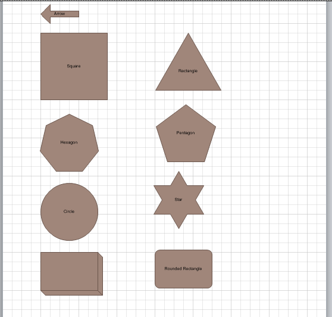
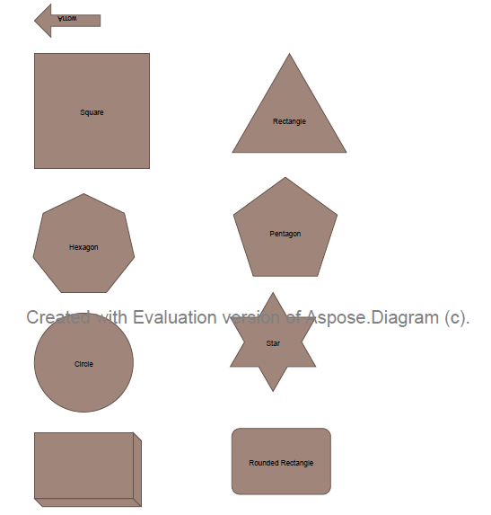

## **Export to PDF**
{}

Aspose.Diagram for Python via .NET directly writes the information about the API and Version Number in output documents. For example, upon rendering a Drawing to PDF, Aspose.Diagram for .NET populates **Application** field with value 'Aspose.Diagram' and **PDF Producer** field with value, e.g 'Aspose.Diagram 17.9'.

Please note that you cannot instruct Aspose.Diagram for .NET API to change or remove this information from output Documents.

{}

This article explains how to export a Microsoft Visio diagram to PDF using [Aspose.Diagram for Python via .NET](https://products.aspose.com/diagram/python-net/) API.

Use the [Diagram] class constructor to read the diagram files and the Save method to export the diagram to any supported image format.

The image below shows the VSD diagram that the code snippets below export PDF. You can use other diagram formats (VSS, VSSM, VDX, VST, VSTX, VDX, VTX or VSX) as well.

|**The source file.**|
| :- |
||

To export VSD diagram to PDF:

1. Create an instance of the Diagram class.
1. Call the Diagram classs Save method and set the output format to PDF.

Below is an image of the output PDF file.

|**The output PDF file.**|
| :- |
||
### **Export Microsoft Visio Drawing to PDF**
The code samples show how to export Microsoft Visio Drawing to PDF using Python.


