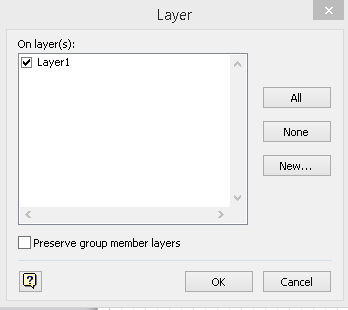

### **Configuring Shape Objects with Layers**
Aspose.Diagram for Java allows to configure shape objects with layers in Microsoft Office Visio diagram. Each shape can belong to multiple layers so developers can manage shapes to suit end user needs.

The [Shape](https://reference.aspose.com/diagram/java/com.aspose.diagram/Shape) class object offers LayerMember property which allows to add / remove shape objects to / from the layers in Visio drawing. Users can manage these properties programmatically using Aspose.Diagram API as follows:

**Add, remove and move shape objects to / from layers of the diagram.** 

The following piece of code helps to add, remove and move shape objects properties.
#### **Programming Samples**

### **Add a Layer in the Visio PageSheet**
Aspose.Diagram for Java allows developers to add new layers to organize custom categories of shapes, and then assign shapes to those layers programmatically.

The [LayerCollection](https://reference.aspose.com/diagram/java/com.aspose.diagram/LayerCollection) class offers add method which allows to add a new [Layer](https://reference.aspose.com/diagram/java/com.aspose.diagram/layer) class object in the Visio drawing. Developers can set Layer properties by initializing its class object.

The following piece of code helps to add Layer objects.
#### **Programming Samples**


{} 

Aspose.Diagram for Java gives developers access to the existing layers of Visio diagram.

{} 
### **Get All Available Layers**
The [PageSheet](https://reference.aspose.com/diagram/java/com.aspose.diagram/PageSheet) property of the [Page](https://reference.aspose.com/diagram/java/com.aspose.diagram/Page) class allows to retrieve the list of available layers from the Visio diagram using [LayerCollection](https://reference.aspose.com/diagram/java/com.aspose.diagram/layercollection) class.

The following piece of code helps to get list of Layers.
#### **Programming Samples**

