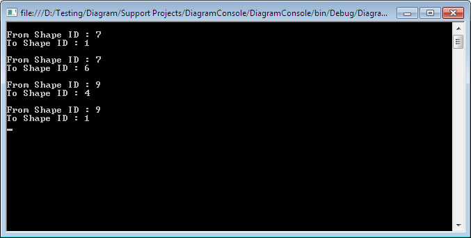

## **Retrieving Connector Information**
Aspose.Diagram for Java provides mechanisms for retrieving information - ID and name - about [pages](/diagram/java/retrieve-2c-get-2c-copy-and-insert-a-page/) and [master](). It also lets you get information about connectors, the elements that link shapes.

The [Connect](https://apireference.aspose.com/diagram/java/com.aspose.diagram/connect) object represents a connector that joins two shapes on a Visio drawing page. The Connects property, exposed by the [Page](http://www.aspose.com/api/java/diagram/com.aspose.diagram/classes/Page) class supports a collection of Aspose.Diagram.Connect objects. This property can be used to retrieve ID and name information about a connector.

**A console window showing the output from the code below.** 

### **Programming Sample**
The following piece of code retrieves the information for the connectors in a diagram.


## **Retrieving Font Information**
Aspose.Diagram has mechanisms for retrieving information about the elements that make up a diagram, from [pages](/diagram/java/retrieve-2c-get-2c-copy-and-insert-a-page/), [stencils](), [connectors](/pages/createpage.action?spaceKey=diagramjava&title=Retrieving+Connector+Information&linkCreation=true&fromPageId=18612234) and also fonts. This article shows how to find out which fonts are used in a diagram.

The [Font](https://apireference.aspose.com/diagram/java/com.aspose.diagram/font) object represents a typeface that is either applied to text in a document or available for use on the system.

A Font object maps a name (for example, "Arial") to the font ID (for example, 3) that Microsoft Visio stores in a Font cell in a Character section of a shape that contains text formatted with that font. Font IDs can change when a document is opened on different systems or when fonts are installed or removed.
### **Retrieving Font Programming Sample**
The following piece of code retrieves font information from the Visio diagram.



### **Getting Default Font Directory**
Aspose.Diagram for Java API also allows getting default font directory path using getDefaultFontDir() method of Diagram Class. The following piece of code retrieves default font directory from the Visio diagram.


