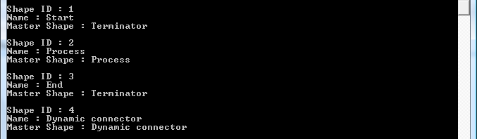

## **Adding a New Shape in Visio**
Aspose.Diagram for Java allows you to manipulate Microsoft Visio diagrams in different ways. One of the things you can do is add new shapes to a diagrams. Aspose.Diagram for Java lets you to add a new shape to a diagram. The added shape can also be customized using Aspose.Diagram for Java.

This topic describes how to add a new rectangle shape to a diagram.

Use Aspose.Diagram for Java API to create new shapes and then add these shapes to a diagram's shapes collection.

To add a new shape:

1. **Find the page** - Each Visio diagram contains a collection of pages. Developers may retrieve the page by page ID or Name and store the required page in the [Page](https://apireference.aspose.com/diagram/java/com.aspose.diagram/page) class object.
1. **Add the require Master of a Shape** - Each Visio diagram contains a collection of masters. Developers may add a Master (by ID or Name) from the existing stencil file (by direct path or file stream).
1. **Add shape in the Visio diagram** - Developers can place a new shape in the Visio diagram by page index (starting from 0), master name, PinX, PinY, height (optional) and width (optional).
1. **Set shape properties** - AddShape method of the Diagram class returns the shape ID. Developers can retrieve shape from a Visio diagram by using this ID, and then set its properties, e.g. color, position, alignment and text.

|
**The input diagram** 

|
**The diagram with a shape added** 

|
| :- | :- |
### **Add Programming Sample**
The code snippet below shows how to do each step.



{}

We welcome your queries and suggestions at [Aspose.Diagram Forum](https://forum.aspose.com/c/diagram/17). We'll reply promptly.

{}
## **Retrieving Shape Information**
[Working with Diagrams](/diagram/java/working-with-diagrams/) explains how to create diagrams, add shapes and connectors, and then how to retrieve information about diagram elements such as [pages](/diagram/java/retrieve-get-copy-and-insert-a-page/), [masters](https://docs.aspose.com/diagram/java/working-with-masters/), [connectors](https://apireference.aspose.com/diagram/java/com.aspose.diagram/ConnectCollection) and [fonts](https://apireference.aspose.com/diagram/java/com.aspose.diagram/FontCollection). This article looks at how to retrieve information about shapes in a diagram.

Each shape in a diagram has an ID and a name. The ID is important when programming with Visio: it is the main method for accessing a shape. Each shape also retains information about what master (stencil) it is made from.

A [Shape](http://www.aspose.com/api/java/diagram/com.aspose.diagram/shape) is an object in a Visio drawing. The Shapes property, exposed by the Page class, supports a collection of Aspose.Diagram.Shape objects. The Shapes property can be used to retrieve information about a shape.

In the console window below, for example, you can see information output for a diagram that contained four shapes: two terminators, a process and a dynamic connector. Each has a unique ID as well as the name of the master (stencil) shape.

|**A console window showing shape information**|
| :- |
||
To retrieve Visio page information:

1. Loads a diagram.
1. Sets up a foreach loop to loop through all the shapes in the diagram.
1. Displays shape information.
### **Retrieve Programming Sample**
The following piece of code retrieve the shape information from a Visio diagram.



## **Copy Shapes from an Existing Visio**
Aspose.Diagram for Java API allows developers to copy shapes from the source Visio page to the new Visio diagram page. It also supports copying group shapes. This article describes how to copy all shapes from the the source diagram page.

To copy shapes, developers should also copy source PageSheet and source Visio themes to preserve shape fill style and other formatting properties.

This example work as follows:

1. Load a source Visio.
1. Initialize a new Visio
1. Add masters and themes from the source Visio.
1. Get page from the source Visio.
1. Copy its PageSheet to the new Visio Page.
1. Iterate through the shapes of the source Visio page.
1. Set its new id and add to the new Visio page.
1. Save the new Visio in the local storage.
### **Copy Programming Sample**


{}

We welcome your queries and suggestions at [Aspose.Diagram Forum](https://forum.aspose.com/c/diagram/17). We'll reply promptly.

{}
## **Copy a Visio Shape to another Shape instance**
The Copy method of the Shape class takes a shape instance to clone.

## **Reading Visio Shape Data**
The Props collection exposed by the [Shape](http://www.aspose.com/api/java/diagram/com.aspose.diagram/shape) class supports the [Aspose.Diagram.Prop](http://www.aspose.com/api/java/diagram/com.aspose.diagram/prop) object. The property can be used to read a shape's data (custom properties).
### **Read All Shape Properties**
To identify custom properties in Microsoft Visio:

1. In a diagram, right-click a shape.
1. Select **Data**, then **Shape Data** from the menu.
   Any existing properties are listed in the dialog.

|**A shape's data, as seen in Microsoft Visio.**|** |
| :- | :- |
|| |

|**A console window showing the shape data output.**|** |
| :- | :- |
|| |
#### **Read Programming Sample**
The code snippets below reads shape data (custom properties).



### **Read a Shape Property by Name**
The code snippet below reads a shape property by name (custom property).
#### **Read by Name Programming Sample**


## **Use Connection indexes to connect shapes**
Aspose.Diagram for Java API already allows developers to add new connecting points on the shape, and developers can now connect shapes using connection indexes.
### **Use Connection indexes to connect shapes**
The ConnectShapesViaConnectorIndex member exposed by the [Page](https://apireference.aspose.com/diagram/java/com.aspose.diagram/page) class can be used to connect shapes using connection indexes. 

1. Initialize a new drawing.
1. Place four rectangle shapes
1. Add two additional connection points, so that there would be three connection points on the bottom border line
1. Connect first shape from each bottom connection to other three rectangle shapes from Top with dynamic connectors
1. Save drawing
#### **Use connection indexes to connect shapes Programming Sample**
Use the following code in your Java application to connect shapes using connection indexes with Aspose.Diagram for Java API.

## **Retrieve the Parent Shape of a Sub-Shape**
Aspose.Diagram for Java allows developers to retrieve the parent shape of a sub-shape.
### **Get the Parent Shape**
The [Shape](http://www.aspose.com/api/java/diagram/com.aspose.diagram/shape) class offers ParentShape property to retrieve the parent shape.
#### **Get the Parent Shape Programming Sample**


