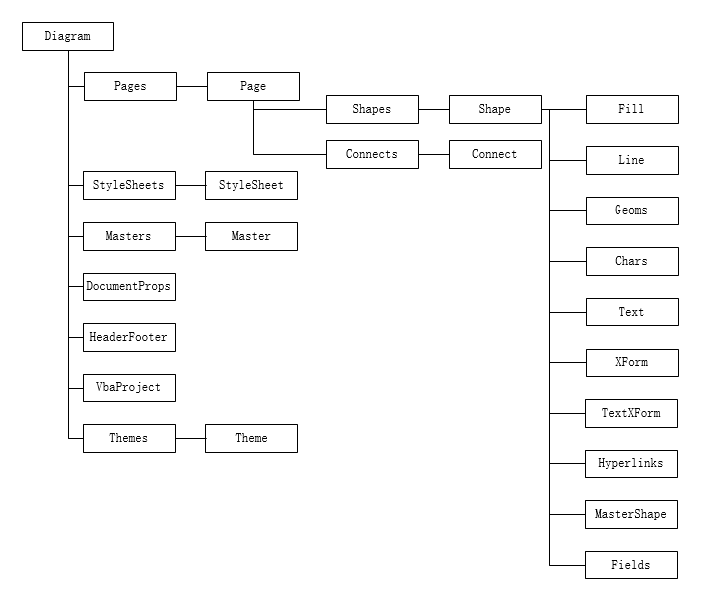

{} 

**Aspose.Diagram Object Model**

Aspose.Diagram Object Model provides information about the structural relationships between the objects of Aspose.Diagram class library.

{} 

The top level structure of the Aspose.Diagram object model is shown below in a hierarchical manner.
----

|**Top level structure of Aspose.Diagram Object Model**|
| :- |
||

As you can see from the above figure that the root of the object model is the Diagram object. A brief description of few of the objects is provided below for the introductory purposes.

**PageCollection/Page**
Diagram object contains the PageCollection, which represents the collection of all the Page objects in a Diagram.

**ShapeCollection/Shape**
Page object contains the ShapeCollection, which represents the collection of all the Shape objects in a Page . Shape object contains elements that define a shape in a Master, Page, or group shape element.

**ConnectCollection/Connect**
Page object contains the ConnectCollection, which represents the collection of all the Connect objects in a Page . Connect object represents a connection between two shapes in a drawing, such as a line and a box in an organization chart.

**StyleSheetCollection/StyleSheet**
Represents a style defined in a document.

**MasterCollection/Master**
Contains elements that define a master for the document. A master is a shape on a stencil that you use repeatedly to create drawings. When you drag a shape from a stencil onto the drawing page, the shape becomes an instance of that master, and a local copy of the master is included in the document.

**DocumentProperties**
Contains document property elements such as the document's title, author, and so on.

**HeaderFooter**
Contains elements for a document's header and footer.

**VbaProject**
Represents the VBA project.

**ThemeCollection/Theme**
Dynamic theme defines properties that specify properties for color, font, fill, line properties, and effect.

**Fill**
Contains the current fill formatting values for the shape and the shape's drop shadow, including pattern, foreground color, and background color.

**Line**
Contains elements that control line attributes for a shape, such as pattern, weight, and color. These elements determine whether the line ends are formatted (for example, with an arrowhead), the size of line end formats, radius of the rounding circle applied to the line, and line cap style (round or square).

**Geoms**
Contains a collection of Geom elements.

**Chars**
Contains a collection of Char object which contains text styles of the shape.

**Text**
Contains the text of a shape.

**XForm**
Contains elements specifying general positioning information about a shape.

**TextXForm**
Contains elements that specify positioning information about a shape's text block.

**HyperlinkCollection/Hyperlink**
Hyperlink object contains elements for creating multiple jumps between a shape or drawing page and another drawing page, another file, or a Web site.

**MasterShape**
This attribute may only be present in shapes that are members of a group shape, and the group is an instance of a master. The attribute contains an ID that references the corresponding sub-shape in the master.

**FieldCollection/Field**
Field object contains elements that specify functions and formulas inserted in the shape's text.
