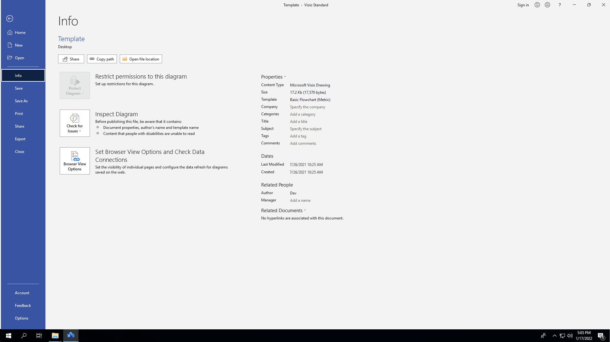
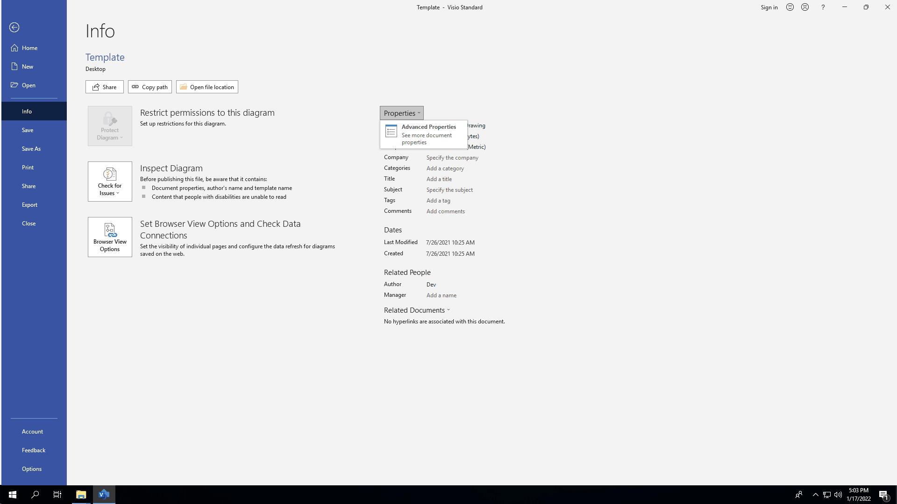
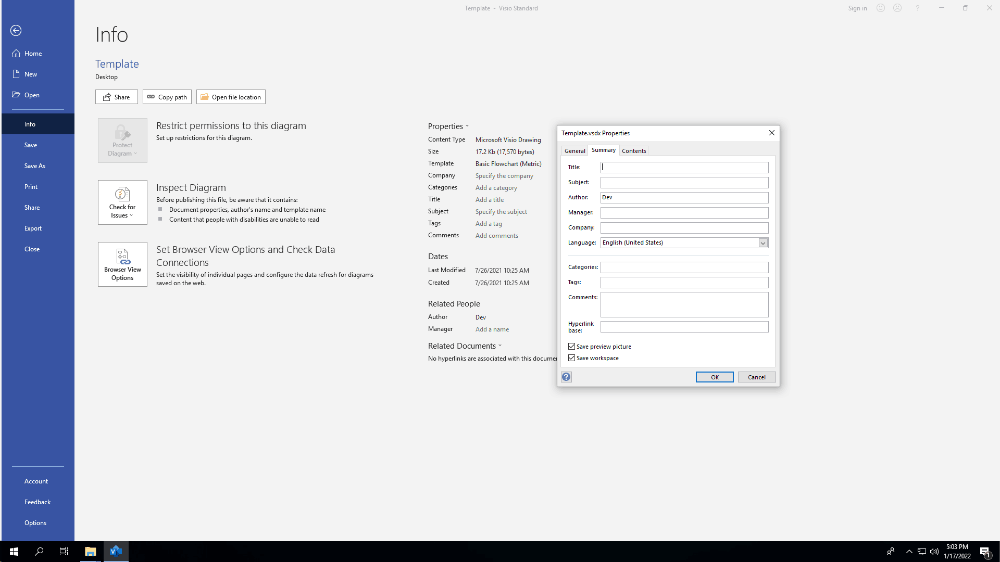

## **Introduction**

Microsoft Visio provides the ability to add properties to visio files. These document properties provide useful information and are divided into 2 categories as detailed below.

- System-defined (built-in) properties: Built-in properties contain general information about the document like document title, author name, document statistics and so on.
- User-defined (custom) properties: Custom properties defined by the end user in the form of name-value pair.

{}

The most important point to know about built-in and custom properties is that built-in properties can be accessed and modified, but not created or removed. However, custom properties can be created and managed.

{}

## **Managing Document Properties Using Microsoft Visio**

Microsoft Visio allows you to manage the document properties of the Visio files in a WYSIWYG manner. Please follow the below steps to open the **Properties** dialog in Visio 2016.

1. From the **File** menu, select **Info**.

|**Selecting Info Menu**|
| :- |
||
1. Click on **Properties** heading and select "Advanced Properties".

|**Clicking Advanced Properties Selection**|
| :- |
||
1. Manage the file's document properties.

|**Properties Dialog**|
| :- |
||
In the Properties dialog, there are different tabs, like General, Summary, Statistics, Contents, and Customs. Each tab helps configure different kinds of information related to the file. The Custom tab is used to manage custom properties.

## **Working with Document Properties Using Aspose.Diagram**

Developers can dynamically manage the document properties using the Aspose.Diagram APIs. This feature helps the developers to store useful information along with the file, such as when the file was received, processed, time-stamped and so on.

{}

Aspose.Diagram for .NET directly writes the information about API and Version Number in output documents.

Please note that you cannot instruct Aspose.Diagram for .NET to change or remove this information from output Documents.

{}

### **Accessing Document Properties**

Aspose.Diagram APIs support both types of document properties, built-in and custom. Aspose.Diagram' [**Diagram**](https://reference.aspose.com/diagram/net/aspose.diagram/Diagram) class represents a Visio file and, like a visio file, the [**Diagram**](https://reference.aspose.com/diagram/net/aspose.diagram/Diagram) class can contain multiple pages, each represented by the [**Page**](https://reference.aspose.com/diagram/net/aspose.diagram/page) class whereas the collection of pages is represented by the [**PageCollection**](https://reference.aspose.com/diagram/net/aspose.diagram/pagecollection) class.

Use the [**Diagram**](https://reference.aspose.com/diagram/net/aspose.diagram/Diagram) to access the file's document properties as described below.

- To access built-in document properties, use [**diagram.DocumentProps**](https://reference.aspose.com/diagram/net/aspose.diagram/documentproperties).
- To access custom document properties, use [**diagram.DocumentProps.CustomProps**](https://reference.aspose.com/diagram/net/aspose.diagram/documentproperties/properties/customprops).



### **Adding or Removing Custom Document Properties**

As we have described earlier at the beginning of this topic, developers can't add or remove built-in properties because these properties are system-defined but it's possible to add or remove custom properties because these are user-defined.

### **Adding Custom Properties**

Aspose.Diagram APIs have exposed the [**Add**](https://reference.aspose.com/diagram/net/aspose.diagram/custompropcollection/methods/add) method for the [**CustomPropCollection**](https://reference.aspose.com/diagram/net/aspose.diagram/custompropcollection) class in order to add custom properties to the collection.



### **Removing Custom Properties**

To remove custom properties using Aspose.Diagram, call the [**CustomPropCollection.Remove**](https://reference.aspose.com/diagram/net/aspose.diagram/custompropcollection/methods/remove) method and pass the name of the document property to be removed.


