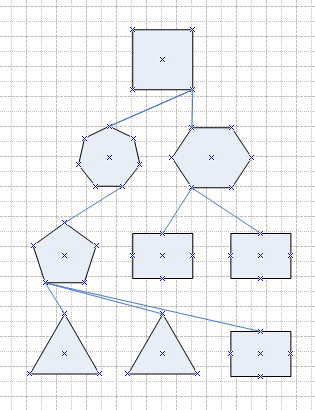

## **Creating a Diagram**
Aspose.Diagram for .NET lets you read and create Microsoft Visio diagrams from within your own applications, without Microsoft Office Automation. The first step when creating new documents, is to create a diagram. Then [add shapes and connectors](/pages/createpage.action?spaceKey=diagramnet&title=Add+and+Connect+Visio+Shapes&linkCreation=true&fromPageId=18350161) to build up the diagram. Use the default constructor of [Diagram](http://www.aspose.com/api/net/diagram/aspose.diagram/diagram) class to create a new diagram.
### **Programming Sample**

## **Layout Shapes in Flowchart Style**
With certain types of connected drawings, such as flowcharts and network diagrams, you can use the **Layout Shapes** feature to automatically position shapes. Automatically positioning is faster than manually dragging each shape to a new location.

For example, if you're updating a large flowchart to include a new process, you can add and connect the shapes that make up the process, and then use the layout feature to automatically layout the updated drawing.

The Layout method, exposed by the [Diagram](http://www.aspose.com/api/net/diagram/aspose.diagram/diagram) class layouts the shapes and/or reroutes the connectors on all the diagram's pages. This method accepts an [LayoutOptions](http://www.aspose.com/api/net/diagram/aspose.diagram/layoutoptions) object as an argument. Use the different properties exposed by the LayoutOptions class to automatically layout shapes.

The image below shows the diagram loaded by the code snippets in this article, before auto layout is applied. The code snippets show how to apply [flowchart layouts](/diagram/net/create-2c-update-2c-layout-and-auto-fit-shapes/) and [compact tree layouts](/diagram/net/create-2c-update-2c-layout-and-auto-fit-shapes/).

**The source diagram.** 

The code snippets in this article takes the source diagram and applies several types of auto layout to it, saving each in a separate file.

|
**Layout shapes bottom to top** 

|
**Layout shapes top to bottom** 

|
| :- | :- |
|
**Layout shapes left to right** 

|
**Layout shapes right to left** 

|
To layout shapes in flowchart style:

1. Create an instance of the Diagram class.
1. Create an instance of LayoutOptions class and set Flowchart style related properties.
1. Call the Diagram class' Layout method by passing LayoutOptions.
1. Call the Diagram class' Save method to write the Visio drawing.
### **Flowchart Style Programming Sample**

### **Laying Out Shapes in the Compact Tree Style**
The compact tree layout style tries to built a tree structure. It uses the same input file as the [example above](/diagram/net/create-2c-update-2c-layout-and-auto-fit-shapes/) and saves out to several different compact tree styles.

|
**Compact tree layout - down and right** 

|
| :- |
|
**Compact tree layout - down and left** 

|

|
**Compact tree layout - right and down** 

|
**Compact tree layout - left and down** 

|
| :- | :- |
To layout shapes in the compact tree style:

1. Create an instance of the [Diagram](http://www.aspose.com/api/net/diagram/aspose.diagram/diagram) class.
1. Create an instance of the LayoutOptions class and set compact tree style properties.
1. Call the Diagram class' Layout method by passing LayoutOptions.
1. Call the the Diagram class' Save method to write the Visio file.
#### **Compact Tree Style Programming Sample**

## **Auto-fit the Visio Diagram**
Aspose.Diagram API supports auto-fitting of the Visio drawing. This feature operation helps to bring outside shapes inside the Visio page boundary. Aspose.Diagram for .NET API has the [Diagram](http://www.aspose.com/api/net/diagram/aspose.diagram/diagram) class that represents a Visio drawing. The [DiagramSaveOptions](http://www.aspose.com/api/net/diagram/aspose.diagram/diagramsaveoptions) class exposes AutoFitPageToDrawingContent property to auto fit the Visio drawing.

This example work as follows:

1. Create an object of the Diagram class.
1. Create an object of the DiagramSaveOptions class and pass the resultant file format.
1. Set AutoFitPageToDrawingContent property of the DiagramSaveOptions object.
1. Call Save method of the Diagram class object and also pass complete file path and the DiagramSaveOptions object.
### **Auto-fit Programming Sample**
The following example code shows how to auto-fit shapes in the Visio diagram.


## **Working with VBA Project**
### **Modify VBA Module Code in Visio Diagram**
This article demonstrates how to modify a VBA module code automatically using Aspose.Diagram for .NET. We have added [VbaModule](http://www.aspose.com/api/net/diagram/aspose.diagram.vba/VbaModule), [VbaModuleCollection](http://www.aspose.com/api/net/diagram/aspose.diagram.vba/VbaModuleCollection), [VbaProject](http://www.aspose.com/api/net/diagram/aspose.diagram.vba/VbaProject), [VbaProjectReference](http://www.aspose.com/api/net/diagram/aspose.diagram.vba/VbaProjectReference) and [VbaProjectReferenceCollection](http://www.aspose.com/api/net/diagram/aspose.diagram.vba/VbaProjectReferenceCollection) classes. These classes help to get control over VBA project. Developers can extract and modify VBA module code.
### **Modify VBA Module Code Programming Sample**
Please check this code example:


### **Remove All Macros from the Visio Diagram**
Aspose.Diagram for .NET allows developers to remove all macros from the Visio diagram. The VbProjectData property, exposed by the [Diagram](http://www.aspose.com/api/net/diagram/aspose.diagram/diagram) class, allows you to remove all macros from the Visio drawing.
### **Remove All Macros Programming Sample**

## **Creating a New Diagram with VSTO**
[Aspose.Diagram for .NET](http://www.aspose.com/.net/diagram-component.aspx) lets developers to create and work with Microsoft Office Visio diagrams and incorporate features in their software applications. There are other ways of working with Visio files, most commonly, Microsoft Automation. Unfortunately, that has some limitations. Aspose.Diagram is powerful and fast and works independently without Microsoft Office installation.

This migration article shows how to use first [VSTO](/diagram/net/create-2c-update-2c-layout-and-auto-fit-shapes/) and then [Aspose.Diagram for .NET](/diagram/net/create-2c-update-2c-layout-and-auto-fit-shapes/) to create a new diagram and add some shapes to it. You'll notice that the Aspose.Diagram code is shorter than VSTO code. Feel free to use the code as a base for your own development and enhance it to meet your needs. VSTO lets you program with Microsoft Visio files. To create a new diagram:

1. Create a Visio application object.
1. Make the application object invisible.
1. Create an empty diagram.
1. Add shapes from Visio masters (stencils).
1. Save the file as VDX.
### **Create New Diagram with VSTO Programming Sample**
{} 

using Visio = Microsoft.Office.Interop.Visio;
Imports Visio = Microsoft.Office.Interop.Visio

{} 

**Example:**


## **Creating a New Diagram with Aspose.Diagram for .NET**
Using Aspose.Diagram API, developers don't need Microsoft Office Visio installation on the machine, and they can work independently of Microsoft Office Automation.

To create a new diagram:

1. Create an empty diagram.
1. Add shapes from Visio masters (stencils).
1. Save the file as VDX.
### **New Diagram with Aspose.Diagram for .NET Programming Sample**
{} 

using Aspose.Diagram;
Imports Aspose.Diagram

{} 

Example:


## **Update Shape Properties**
When working with Microsoft Visio diagrams, users can update shape attributes including text, style, position, height and width. As a software developer working with Visio files, you'll be asked to do this programmatically. The good news is that it is possible, either using the mechanisms for programming with Visio files that Microsoft provides, VSTO, or using [Aspose.Diagram for .NET](http://www.aspose.com/.net/diagram-component.aspx).

Below topic shows how to use [VSTO](/diagram/net/create-2c-update-2c-layout-and-auto-fit-shapes/) and [Aspose.Diagram](/diagram/net/create-2c-update-2c-layout-and-auto-fit-shapes/) to update shape properties. The code snippets below show how to update shape properties for VSTO and Aspose.Diagram for .NET. Feel free to use the code and apply it to your particular situation.
### **Updating Shape Properties with VSTO**
VSTO lets you program with Microsoft Visio files. To update shape properties:

1. Create a Visio application object.
1. Make the application object invisible.
1. Open an existing Visio VSD file.
1. Find the required shape.
1. Update the shape properties (text, text style, position and size).
1. Save the file as VDX.
#### **Updating Shape Properties with VSTO Programming Sample**
{} 

using Visio = Microsoft.Office.Interop.Visio;
Imports Visio = Microsoft.Office.Interop.Visio

{} 

**Example:**


### **Updating Shape Properties with Aspose.Diagram for .NET**
Using Aspose.Diagram API, developers don't need Microsoft Office Visio on the machine, and they can work independently of Microsoft Office Automation.

To update shape properties with Aspose.Diagram for .NET:

1. Open an existing Visio VSD file.
1. Find the required shape.
1. Update the shape properties (text, text style, position and size).
1. Save the file as VDX.
#### **Updating Shape Properties with Aspose.Diagram for .NET Programming Sample**
{} 

using Aspose.Diagram;
Imports Aspose.Diagram

{} 

**Example:**


