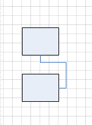

## **Connect Shapes**
This section explains how to connect two shapes using Aspose.Diagram for .NET.
### **Connect Shapes**
The [ConnectShapesViaConnector](https://apireference.aspose.com/diagram/net/aspose.diagram.page/connectshapesviaconnector/methods/1) method connect two shapes via a connector in the [Page](http://www.aspose.com/api/net/diagram/aspose.diagram/page) class.

The code below shows how to:

1. Create a diagram from stencil.
1. Add two rectangles shape to page.
1. Add a connector shape to page.
1. Connect the two rectangles with the connector using ConnectShapesViaConnector mothod
1. save diagram
#### **Connect Shapes Programming Sample**
Use the following code in your .NET application to connect shapes using Aspose.Diagram for .NET.



|**Result**|
| :- |
||