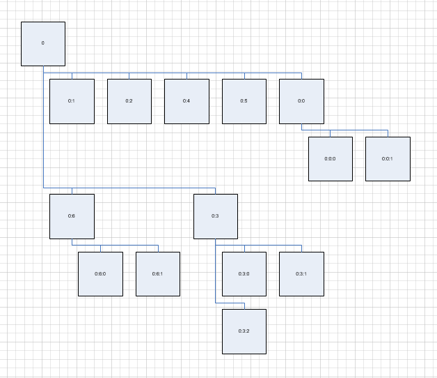
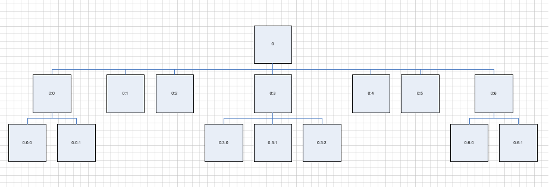

## ** Create a Organization Chart**
This section explains how to create a organization chart using Aspose.Diagram.
### **Create a CompactTree style Organization Chart**
The Layout method of the [Page](https://apireference.aspose.com/diagram/java/com.aspose.diagram/Page) class auto layout the shapes and connectors in the page as a CompactTree  style Organization Chart.

The code below shows how to:

1. Create a diagram from stencil.
1. Add organization node shapes to page.
1. Add connectors to page to connect shape and its parent.
1. Auto layout by invoking Layout mothod
1. save diagram
#### **Create a CompactTree style Organization Chart Programming Sample**
Use the following code to Create a CompactTree style Organization Chart using Aspose.Diagram.



|**Result**|
| :- |
||

### **Create a FlowChart style Organization Chart**
The Layout method of the [Page](https://apireference.aspose.com/diagram/java/com.aspose.diagram/Page) class auto layout the shapes and connectors in the page as a FlowChart style Organization Chart.

The code below shows how to:

1. Create a diagram from stencil.
1. Add organization node shapes to page.
1. Add connectors to page to connect shape and its parent.
1. Auto layout by invoking Layout mothod
1. save diagram
#### **Create a FlowChart style Organization Chart Programming Sample**
Use the following code to Create a FlowChart style Organization Chart using Aspose.Diagram.



|**Result**|
| :- |
||