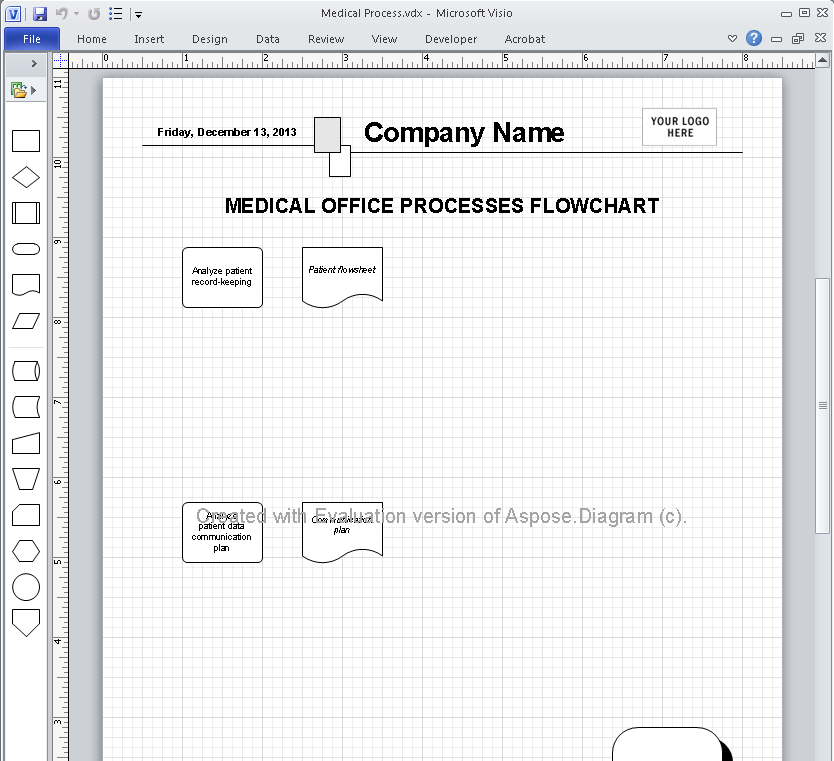

## **Evaluate Aspose.Diagram**
You can easily download Aspose.Diagram for .NET product for evaluation purposes. Please refer to the [Aspose.Diagram for .NET download page](https://www.nuget.org/packages/Aspose.Diagram/) to find out the latest version. The evaluation download is same as the purchased download. The evaluation version simply becomes licensed when you add a few lines of code to apply the license.

The evaluation version of Aspose.Diagram (without a license specified) provides full product functionality, but it inserts an evaluation watermark in the middle of the document on open and save, and limits to read only the first ten shapes of the first page of your Visio diagram.

### **Evaluation Version Limitations**
The evaluation version provides all the features except the following:

- You can read only the first ten shapes of first page of Visio diagram.
- You will also see evaluation watermark in exported images and PDF files.

{} 

If you want to try Aspose.Diagram out without evaluation limitations, request a 30 day temporary license. Please refer to [How to get a Temporary License?](https://purchase.aspose.com/temporary-license) for more information.

{} 
## **Applying a License**
Once you are happy with your [evaluation](https://downloads.aspose.com/diagram/net) of Aspose.Diagram for .NET, buy a license at the Aspose website: [Purchase Portal](https://purchase.aspose.com/buy). Make yourself familiar with the different license types available. If you have any questions, [contact the Aspose sales team](https://about.aspose.com/contact) and they'll be happy to help you.

Every Aspose license carries a one-year subscription for free upgrades to any new versions or fixes that come out during this time. We provide free and unlimited technical support to both licensed and evaluation users.

The license is a plain text XML file that contains details such as the product name, number of licensed developers, subscription expiry date and so on. The file is digitally signed, so do not modify the file: even adding an extra line break to the file invalidates it.
### **When to Apply a License**
Follow these simple rules:

- The license only needs to be set once per application domain.
- You need to set the license before using any other Aspose.Diagram classes.
- Calling SetLicense multiple times is not harmful, but wastes processor time.
- If you are developing a Windows Forms or console application, call SetLicense in the startup code, before using Aspose.Diagram classes.
- When developing an ASP.NET application, call SetLicense from the Global.asax.cs file, in the Aplication_Start protected method. It is called once when the application starts.
- Do not call SetLicense from within the Page_Load methods since it means the license will be loaded every time a web page is loaded.
- If you are developing a class library, you call SetLicense from a static constructor of the class that uses Aspose.Diagram. The static constructor executes before an instance of your class is created making sure Aspose.Diagram license is properly set.
### **Apply License using File or Stream Object**
Use the [License.SetLicense](https://apireference.aspose.com/diagram/net/aspose.diagram/license) method to license the component. The easiest way to set a license is to put the license file in the same folder as the Aspose.Diagram.dll and specify the filename, without a path, as shown below.
#### **Loading a License from File**
This code snippet initializes a license stored in a file or in an embedded resource.


#### **Loading a License from a Stream Object**
These code snippets initialize the license from stream.


## **Apply Metered License**
Aspose.Diagram for .NET API allows developers to apply metered license. It is a new licensing mechanism. The new licensing mechanism will be used along with existing licensing method. Those customers who want to be billed based on the usage of the API features can use the metered licensing. For more details, please refer to [Metered Licensing FAQ](https://purchase.aspose.com/faqs/licensing/metered) section.

A new class [Metered](https://apireference.aspose.com/diagram/net/aspose.diagram/metered) has been added to apply metered key. This code example demonstrates how to set metered public and private keys:


