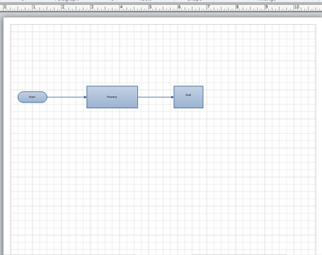
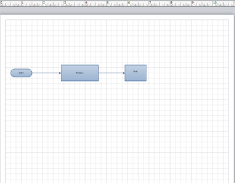

## **Export to XML**
### **Export Microsoft Visio Drawing to PDF**
The code samples show how to export Microsoft Visio Drawing to PDF using C#.



This article explains how to export a Microsoft Visio diagram to XML using [Aspose.Diagram for Python via .NET](https://products.aspose.com/diagram/python-net/) API.

- VDX defines an XML diagram.
- VTX defines an XML template.
- VSX defines an XML stencil.

The [Diagram] class' constructors read a diagram and the Save method is used to save, or export, a diagram in a different file format. The code snippets in this article show how to use the Save method to save a Visio file to [VDX](https://docs.aspose.com/diagram/python-net/save-visio-document/), [VTX](https://docs.aspose.com/diagram/python-net/save-visio-document/) and [VSX](https://docs.aspose.com/diagram/python-net/save-visio-document/).

The image below shows the diagram that is exported in the code snippets below. The exported file is shown before each code snippet.

|**A Microsoft Visio diagram about to be exported.**|
| :- |
||

### **Export VSD to VDX**
VDX is a schema-based XML file format that lets you save diagrams in a format that products other than Microsoft Visio can read. It's a useful format for transferring diagrams between software applications and retaining editable data.

To export a VSD diagram to VDX:

1. Create an instance of the Diagram class.
1. Call the Diagram class' Save method to write the Visio drawing file to VDX.

|**The exported VDX file.**|
| :- |
||

### **Export from VSD to VSX**
VSX is an XML format for defining stencils, the basic objects from which a diagram is built up. When a Visio file is converted to VSX, only the stencils are exported.

To export a VSD diagram to VSX:

- Create an instance of the Diagram class.
- Call the Diagram class' Save method to write the Visio drawing file to VSX.
### **Export VSD to VTX**
TVX is an XML representation of a template file and stores the settings for the document.

To export a VSD diagram to VTX:

1. Create an instance of the Diagram class.
1. Call the diagram class' Save method to write the Visio drawing file in the VTX format.
### **Export Microsoft Visio Drawing to XML**
The code samples show how to export Microsoft Visio Drawing to XML using C#.



## **Export to XPS**
This article explains how to export a Microsoft Visio diagram to XPS using [Aspose.Diagram for Python via .NET](https://products.aspose.com/diagram/python-net/) API.
Use the [Diagram] class' constructor to read the diagram files and the Save method to export the diagram to any supported image format.

The code snippets in this article takes the diagram below as an input. You can use other diagram formats (VSS, VSSX, VSSM, VDX, VST, VSTX, VDX, VTX or VSX) as well.

|**The source document.**|
| :- |
||

To export VSD diagram to XPS:

1. Create an instance of the Diagram class.
1. Call the Diagram class' Save method and set XPS as the output format.
### **Export Microsoft Visio Drawing to XPS**
The code samples show how to export Microsoft Visio Drawing to XPS using C#.



## **Export a Diagram to SVG**
This article explains how to export a Microsoft Visio diagram to SVG (Scalable Vector Graphics) using [Aspose.Diagram for Python via .NET](https://products.aspose.com/diagram/python-net/) API.

Use the [Diagram] class' constructor to read the diagram files and the Save method to export the diagram to any supported image format.

To export VSD diagram to SVG, perform the following steps:

1. Create an instance of the Diagram class.
1. Call the class' Save method and set SVG as the export format.
### **Export Microsoft Visio Drawing to SVG**
The code samples show how to export a diagram to SVG using C#.



To export a Visio drawing with selective shapes:

1. Create an instance of the Diagram class.
1. Create an instance of any SaveOption class to specify settings as narrated here: [Specify Visio Save Options](https://docs.aspose.com/diagram/net/save-visio-document/#specifying-visio-save-options)
1. Call Save method of the Diagram class object and pass save option class object as parameter.
### **Convert Visio Drawing with Selective Shapes Programming Sample**
The code sample shows how to export a drawing with selective Visio shapes.

